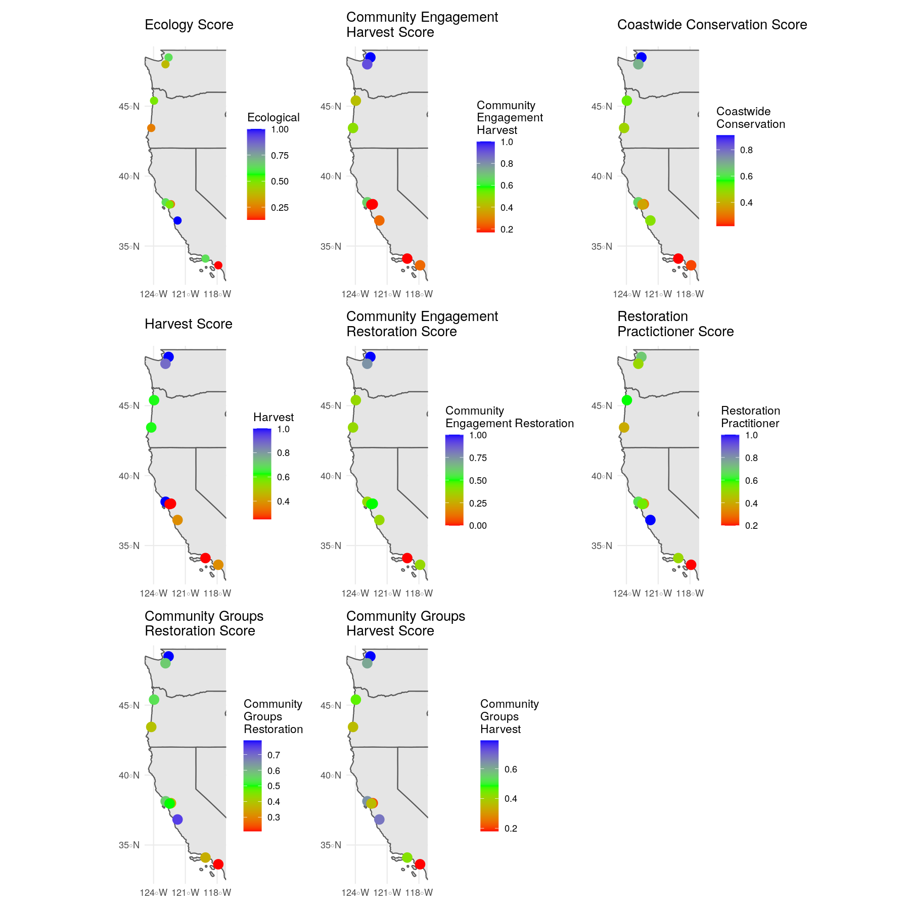
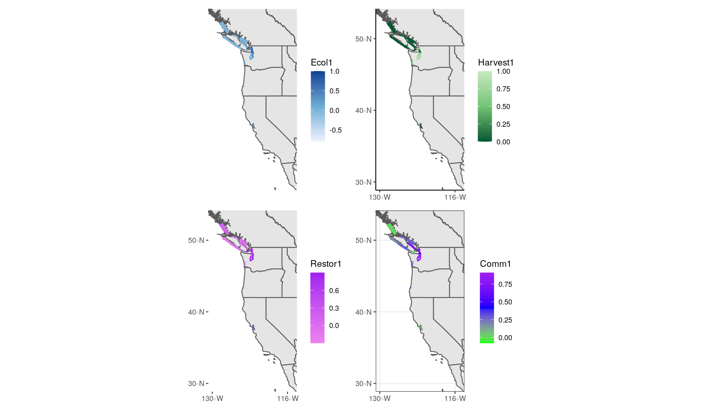

```{r setup, include=FALSE}
knitr::opts_chunk$set(echo = TRUE, message = FALSE)
```

```{r, include=FALSE}
#Loading Packages

library(tidyverse)
library(here)
library(janitor)
library(tmap)
library(tmaptools)
library(ggmap)
library(sf)
library(sp)
library(leaflet)
library(rgdal)
library(rgeos)
library(gridExtra)
library(cowplot)
library(ggpubr)
library(USAboundaries)
library(plotrix)
library(patchwork)
library(scatterpie)
```


*The new maps that have been created using the polygon data start on Line 416*


```{r echo=FALSE, message=FALSE}
#Reading in data

data_goals <- read_csv(here("data", "data_goals.csv"))
data_end_users <- read_csv(here("data", "data_end_users.csv"))
scores_clean <- read_csv(here("data", "scores_clean.csv"))

#reading in county shape files for CA, OR, and WA these will be used for basemaps
ca_counties <- read_sf(dsn = here("locations"), layer = "CA_counties")
or_counties <- read_sf(dsn = here("locations"), layer = "OR_counties")
wa_counties <- read_sf(dsn = here("locations"), layer = "WA_counties")
nv_counties <- read_sf(dsn = here("locations"), layer = "NV_counties")

# Checking projections
# st_crs(ca_counties) #EPSG: 4269
# st_crs(or_counties) #EPSG: 4326
# st_crs(wa_counties) #EPSG: 4326
# st_crs(nv_counties) #EPSG: 4326

# We need to reproject the California layer
ca_counties <- st_transform(ca_counties, crs = st_crs(or_counties))

#Reading in shapefiles for Canada and Mexico
canada <- read_sf(dsn = here("locations"), layer = "lpr_000b16a_e")
# st_crs(canada) #EPSG: 9001
# We need to reproject the Canada layer
canada <- st_transform(canada, crs = st_crs(or_counties))
             
mexico <- read_sf(dsn = here("locations"), layer = "mexstates")
# st_crs(mexico) #EPSG: 4326

```

```{r, message=FALSE}
#This code chunk is going to be where I dissolve the counties of each state so that I am left with only the outline of the state.

ca_counties$area <- st_area(ca_counties)
# ca_counties

ca <- ca_counties %>%
  summarise(area = sum(area))

or_counties$area <- st_area(or_counties)
or <- or_counties %>%
  summarise(area = sum(area))

wa_counties$area <- st_area(wa_counties)
wa <- wa_counties %>%
  summarise(area = sum(area))

nv_counties$area <- st_area(nv_counties)
nv <- nv_counties %>%
  summarise(area = sum(area))


```


### Cleaning and wrangling the score data

```{r, message=FALSE}
#Cleaning and wrangling the data

data_scores <- full_join(data_goals, scores_clean) %>%
  clean_names()


estuary_sf <- data_scores %>%
  drop_na("long") %>%
  st_as_sf(coords = c("long", "lat"), crs = 4326) %>%
  clean_names()

```

```{r}

estuary_reactive_format <- estuary_sf %>%
  gather(score_type, score, -estuary_or_subbasin, -geometry)

# I have put all of the scores into a single column. This should help with the interactive map or if I make a shiny app of the map.

estuary_reactive_lat_lon <- data_scores %>%
  drop_na("long") %>%
  gather(score_type, score, -estuary_or_subbasin, - long, -lat)

```


```{r, message=FALSE}
#Making an interactive map with tmap

snapp_estuary_map <- tm_shape(estuary_sf) +
  tm_dots(labels = "estuary_or_subbasin", col = "green", size = 0.1)

basemap <- tm_basemap("Esri.WorldImagery")

tmap_mode("view")
snapp_estuary_map +
  basemap
```

**Interactive Map of Estuaries: Hovering the mouse over an estuary will show the estuary's name. Clicking on an estuary will show the  estuaries scores.**


```{r include=FALSE}
#This is going to be a static map of estuary locations with color based on the ecology score

ecology_score <- ggplot() +
  geom_sf(data = ca) +
  geom_sf(data = or) +
  geom_sf(data = wa) +
  geom_sf(data = nv) +
  geom_sf(data = estuary_sf, size = 3, aes(color = ecological)) +
  coord_sf(xlim = c(-124.5, -117.5), ylim = c(33, 48.5)) +
  scale_color_gradientn(colors = c(
    "red",
    "green",
    "blue"
  )) +
  theme_minimal() +
  scale_x_continuous(breaks = c(-124, -121, -118)) +
  ggtitle("Ecology Score") +
  labs(colour="Ecological")


# ecology_score

```

```{r include=FALSE}
#This is going to be a static map of estuary locations with color based on the harvest score

harvest_score <- ggplot() +
  geom_sf(data = ca) +
  geom_sf(data = or) +
  geom_sf(data = wa) +
  geom_sf(data = nv) +
  geom_sf(data = estuary_sf, size = 4, aes(color = harvest)) +
  coord_sf(xlim = c(-124.5, -117.5), ylim = c(33, 48.5)) +
  scale_color_gradientn(colors = c(
    "red",
    "green",
    "blue"
  )) +
  theme_minimal() +
  scale_x_continuous(breaks = c(-124, -121, -118)) +
  ggtitle("Harvest Score") +
  labs(colour="Harvest")

# harvest_score

```

```{r include=FALSE}
#This is going to be a static map of estuary locations with color based on the community engagement restoration score

community_restoration_score <- ggplot() +
  geom_sf(data = ca) +
  geom_sf(data = or) +
  geom_sf(data = wa) +
  geom_sf(data = nv) +
  geom_sf(data = estuary_sf, size = 4, aes(color = community_engagement_restotation)) +
  coord_sf(xlim = c(-124.5, -117.5), ylim = c(33, 48.5)) +
  scale_color_gradientn(colors = c(
    "red",
    "green",
    "blue"
  )) +
  theme_minimal() +
  scale_x_continuous(breaks = c(-124, -121, -118)) +
  ggtitle("Community Engagement\nRestoration Score") +
  labs(colour="Community\nEngagement Restoration")
  
# community_restoration_score

```

```{r include=FALSE}
#This is going to be a static map of estuary locations with color based on the community engagement harvest score

community_harvest_score <- ggplot() +
  geom_sf(data = ca) +
  geom_sf(data = or) +
  geom_sf(data = wa) +
  geom_sf(data = nv) +
  geom_sf(data = estuary_sf, size = 4, aes(color = community_engagement_harvest)) +
  coord_sf(xlim = c(-124.5, -117.5), ylim = c(33, 48.5)) +
  scale_color_gradientn(colors = c(
    "red",
    "green",
    "blue"
  )) +
  theme_minimal() +
  scale_x_continuous(breaks = c(-124, -121, -118)) +
  ggtitle("Community Engagement\nHarvest Score") +
  labs(colour="Community\nEngagement\nHarvest")

# community_harvest_score

```


```{r include=FALSE}
#This is going to be a static map of estuary locations with color based on the coastwide conservation score

coastwide_conservation_score <- ggplot() +
  geom_sf(data = ca) +
  geom_sf(data = or) +
  geom_sf(data = wa) +
  geom_sf(data = nv) +
  geom_sf(data = estuary_sf, size = 4, aes(color = coastwide_conservation)) +
  coord_sf(xlim = c(-124.5, -117.5), ylim = c(33, 48.5)) +
  scale_color_gradientn(colors = c(
    "red",
    "green",
    "blue"
  )) +
  theme_minimal() +
  scale_x_continuous(breaks = c(-124, -121, -118)) +
  ggtitle("Coastwide Conservation Score") +
  labs(colour="Coastwide\nConservation")

# coastwide_conservation_score

```

```{r include=FALSE}
#This is going to be a static map of estuary locations with color based on the coastwide planner score

coastwide_planner_score <- ggplot() +
  geom_sf(data = ca) +
  geom_sf(data = or) +
  geom_sf(data = wa) +
  geom_sf(data = nv) +
  geom_sf(data = estuary_sf, size = 4, aes(color = coastwide_planner)) +
  coord_sf(xlim = c(-124.5, -117.5), ylim = c(33, 48.5)) +
  scale_color_gradientn(colors = c(
    "red",
    "green",
    "blue"
  )) +
  theme_minimal() +
  scale_x_continuous(breaks = c(-124, -121, -118)) +
  ggtitle("Coastwide Planner Score") + 
  labs(colour="Coastwide\nPlanner")

# coastwide_planner_score

```

```{r include=FALSE}
#This is going to be a static map of estuary locations with color based on the restoration_practitioner score

restoration_planner_score <- ggplot() +
  geom_sf(data = ca) +
  geom_sf(data = or) +
  geom_sf(data = wa) +
  geom_sf(data = nv) +
  geom_sf(data = estuary_sf, size = 4, aes(color = restoration_practitioner)) +
  coord_sf(xlim = c(-124.5, -117.5), ylim = c(33, 48.5)) +
  scale_color_gradientn(colors = c(
    "red",
    "green",
    "blue"
  )) +
  theme_minimal()+
  scale_x_continuous(breaks = c(-124, -121, -118)) +
  ggtitle("Restoration\nPractictioner Score") +
  labs(colour="Restoration\nPractitioner")

# restoration_planner_score

```

```{r include=FALSE}
#This is going to be a static map of estuary locations with color based on the community groups restoration score

community_groups_restoration_score <- ggplot() +
  geom_sf(data = ca) +
  geom_sf(data = or) +
  geom_sf(data = wa) +
  geom_sf(data = nv) +
  geom_sf(data = estuary_sf, size = 4, aes(color = community_groups_restoration)) +
  coord_sf(xlim = c(-124.5, -117.5), ylim = c(33, 48.5)) +
  scale_color_gradientn(colors = c(
    "red",
    "green",
    "blue"
  )) +
  theme_minimal() +
  scale_x_continuous(breaks = c(-124, -121, -118)) +
  ggtitle("Community Groups\nRestoration Score") + 
  labs(colour="Community\nGroups\nRestoration")

# community_groups_restoration_score 


```

```{r include=FALSE}
#This is going to be a static map of estuary locations with color based on the community groups harvest score

community_groups_harvest_score <- ggplot() +
  geom_sf(data = ca) +
  geom_sf(data = or) +
  geom_sf(data = wa) +
  geom_sf(data = nv) +
  geom_sf(data = estuary_sf, size = 4, aes(color = community_groups_harvest)) +
  coord_sf(xlim = c(-124.5, -117.5), ylim = c(33, 48.5)) +
  scale_color_gradientn(colors = c(
    "red",
    "green",
    "blue"
  )) +
  theme_minimal() +
  scale_x_continuous(breaks = c(-124, -121, -118))+
  ggtitle("Community Groups\nHarvest Score") +
  labs(colour="Community\nGroups\nHarvest")

# community_groups_harvest_score

```


```{r, include=FALSE}
# This code chunk is intended to try to make all of static point maps into one figure.

# ggarrange(ecology_score, community_harvest_score, harvest_score, coastwide_conservation_score, community_restoration_score, ncol = 2, nrow = 3, widths = c(1,1), heights = c(1,1))

#The above figure needs to be cleaned up some more. all of the maps are getting misaligned
# 
# ggarrange(coastwide_planner_score, community_groups_restoration_score, restoration_planner_score,  community_groups_harvest_score, rremove("x.text"),  ncol = 2, nrow = 2, widths = c(1,1), heights = c(1,1))

#for all graphs it would probably be best to remove x-axis labels, titles and legends or clean them up so that they look better in the figure.


g <- ecology_score + community_harvest_score + coastwide_conservation_score +  harvest_score + community_restoration_score + restoration_planner_score + community_groups_restoration_score + community_groups_harvest_score
g

ggsave("figures/map_patchwork.png", g, width = 12, height = 12, dpi = 150)


```

```{r, dot maps, fig.align="center",  echo=FALSE}

```

```{r, include=FALSE}
# Making maps with Shapefiles

pacific_estuary <- read_sf(dsn = here("locations"), layer = "Pacific_estuary_shore_dist") %>%
  st_transform(crs = 4326)
  

# st_crs(pacific_estuary) checking the coordingate reference system of pacific_esturary

#plot(pacific_estuary)

pacific_estuary_plot <- ggplot() +
  #geom_sf(data = ca) +
  #geom_sf(data = wa) +
  #geom_sf(data = or) +
  #geom_sf(data = nv) +
  geom_sf(data = us_boundaries())+
  geom_sf(data = pacific_estuary, aes(fill = shore_dist), lwd = 0) +
  scale_fill_gradientn(colours = c(
    "red",
    "green",
    "blue"
  )) +
  theme_minimal() +
  scale_x_continuous(limits = c(-124, -118), breaks = c(-124, -121, -118))  +
  scale_y_continuous(limits = c(30, 50), breaks = c(35, 40, 45))

pacific_estuary_plot

#this map would look better if counties were dissolved.


```


## The code below will be using the estuary shapefiles provided by the project.

```{r, include=FALSE}
# Making maps with shapefiles from project partners


SNAPP_estuary_polygons <- read_sf(dsn = here("locations"), layer = "FINAL_SNAPP_ESTUARIES_POLYGONS-66")

head(SNAPP_estuary_polygons)

st_crs(SNAPP_estuary_polygons)

#plot(SNAPP_estuary_polygons$OBJECTID)


SNAPP_estuary_points <- read_sf(dsn = here("locations"), layer = "FINAL_SNAPP_ESTUARIES_POINTS-44")
head(SNAPP_estuary_points)

```

```{r}
# Making individual map of the ecology estuary scores

SNAPP_estuary_ecology_polygons <- ggplot() +
  geom_sf(data = us_boundaries()) +
  geom_sf(data = canada) +
  geom_sf(data = mexico) +
  geom_sf(data = SNAPP_estuary_polygons, aes(fill = Ecol1), lwd = 0) +
  scale_fill_gradientn(colors = c(
    "#eff3ff",
    "#6baed6",
    "#084594"
  )) +
  coord_sf(xlim = c(-130, -115), ylim = c(30, 53)) +
  scale_x_continuous(breaks = c(-130, -116)) +
  scale_y_continuous(breaks = c(30, 40, 50)) +
  theme_void()

# SNAPP_estuary_ecology_polygons

SNAPP_estuary_ecology_points <- ggplot() +
  geom_sf(data = us_boundaries()) +
  geom_sf(data = canada) +
  geom_sf(data = mexico) +
  geom_sf(data = SNAPP_estuary_points, aes(color = Ecol1), size = 3) +
  scale_color_gradientn(colours = c(
    "#eff3ff",
    "#6baed6",
    "#084594"
  )) +
  coord_sf(xlim = c(-130, -115), ylim = c(30, 53)) +
  scale_x_continuous(breaks = c(-130, -116)) +
  scale_y_continuous(breaks = c(30, 40, 50)) +
  theme_void()

# SNAPP_estuary_ecology_points
```


```{r}
#Making individual map of the harvest estuary scores

SNAPP_estuary_harvest_polygons <- ggplot() +
  geom_sf(data = us_boundaries())  +
  geom_sf(data = canada) +
  geom_sf(data = mexico) +
  geom_sf(data = SNAPP_estuary_polygons, aes(fill = Harvest1), lwd = 0) +
  scale_fill_gradientn(
    colors = c(
    "#005a32",
    "#74c476",
    "#c7e9c0"
  )) +
  coord_sf(xlim = c(-130, -115), ylim = c(30, 53)) +
  scale_x_continuous(breaks = c(-130, -116)) +
  scale_y_continuous(breaks = c(30, 40, 50)) +
  theme_classic()
# SNAPP_estuary_harvest_polygons

SNAPP_estuary_harvest_points <- ggplot() +
  geom_sf(data = us_boundaries())  +
  geom_sf(data = canada) +
  geom_sf(data = mexico) +
  geom_sf(data = SNAPP_estuary_points, aes(color = Harvest1), size = 3) +
  scale_color_gradientn(
    colors = c(
    "#005a32",
    "#74c476",
    "#c7e9c0"
  )) +
  coord_sf(xlim = c(-130, -115), ylim = c(30, 53)) +
  scale_x_continuous(breaks = c(-130, -116)) +
  scale_y_continuous(breaks = c(30, 40, 50)) +
  theme_classic()


# SNAPP_estuary_harvest_points
```

```{r}
# Making individual map of the restoration estuary scores

SNAPP_estuary_restoration_polygons <- ggplot() +
  geom_sf(data = us_boundaries())  +
  geom_sf(data = canada) +
  geom_sf(data = mexico) +
  geom_sf(data = SNAPP_estuary_polygons, aes(fill = Restor1), lwd = 0) +
  scale_fill_gradientn(colors = c(
    "violet",
    "purple"
  )) +
  coord_sf(xlim = c(-130, -115), ylim = c(30, 53)) +
  scale_x_continuous(breaks = c(-130, -116)) +
  scale_y_continuous(breaks = c(30, 40, 50)) +
  theme(panel.background = element_blank())

# SNAPP_estuary_restoration_polygons

# Points
SNAPP_estuary_restoration_points <- ggplot() +
  geom_sf(data = us_boundaries())  +
  geom_sf(data = canada) +
  geom_sf(data = mexico) +
  geom_sf(data = SNAPP_estuary_points, aes(color = Resto1), size = 3) +
  scale_color_gradientn(colors = c(
    "violet",
    "purple"
  )) +
  coord_sf(xlim = c(-130, -115), ylim = c(30, 53)) +
  scale_x_continuous(breaks = c(-130, -116)) +
  scale_y_continuous(breaks = c(30, 40, 50)) +
  theme(panel.background = element_blank())


# SNAPP_estuary_restoration_points
```


```{r}
#Making individual map of the community esutary scores


SNAPP_estuary_community_polygons <- ggplot() +
  geom_sf(data = us_boundaries())  +
  geom_sf(data = canada) +
  geom_sf(data = mexico) +
  geom_sf(data = SNAPP_estuary_polygons, aes(fill = Comm1), lwd = 0) +
  scale_fill_gradientn(colors = c(
    "green",
    "blue",
    "purple"
  )) +
  coord_sf(xlim = c(-130, -115), ylim = c(30, 53)) +
  scale_x_continuous(breaks = c(-130, -116)) +
  scale_y_continuous(breaks = c(30, 40, 50)) +
  theme_bw()

SNAPP_estuary_community_points <- ggplot() +
  geom_sf(data = us_boundaries())  +
  geom_sf(data = canada) +
  geom_sf(data = mexico) +
  geom_sf(data = SNAPP_estuary_points, aes(color = Comm1), size = 3) +
  scale_color_gradientn(colours = c(
    "green",
    "blue",
    "purple"
  )) +
  coord_sf(xlim = c(-130, -115), ylim = c(30, 53)) +
  scale_x_continuous(breaks = c(-130, -116)) +
  scale_y_continuous(breaks = c(30, 40, 50)) +
  theme_bw()
  

# SNAPP_estuary_community_polygons
# SNAPP_estuary_community_points
```


```{r, include=FALSE}
#using patchwork to put maps together

collective_estuary_maps_polygons <- SNAPP_estuary_ecology_polygons + SNAPP_estuary_harvest_polygons + SNAPP_estuary_restoration_polygons + SNAPP_estuary_community_polygons

collective_estuary_maps_points <- SNAPP_estuary_ecology_points + SNAPP_estuary_harvest_points + SNAPP_estuary_restoration_points + SNAPP_estuary_community_points


# collective_estuary_maps_polygons

ggsave("figures/final_map_patchwork_polygons.png", collective_estuary_maps_polygons, width = 12, height = 7, dpi = 150)

collective_estuary_maps_points

ggsave("figures/map_patchwork_points.png", collective_estuary_maps_points, width = 12, height = 7, dpi = 150)
```

### Estuaries

#### Polygons based
```{r, estuaries maps, fig.align="center",  echo=FALSE}

```

#### Dots based
```{r, estuaries dot maps, fig.align="center",  echo=FALSE}
knitr::include_graphics("figures/map_patchwork_points.png")
```

```{r}
#Here I am going to be working on displaying multiple attributes on one map I will be using points for these maps

ecology_harvest_map <- ggplot() +
  geom_sf(data = us_boundaries()) +
  geom_sf(data = canada) +
  geom_sf(data = mexico) +
  geom_sf(data = SNAPP_estuary_points, aes(color = Harvest1, size = Ecol1)) +  
  scale_color_gradientn(
    colors = c(
    "#005a32",
    "#74c476",
    "#c7e9c0"
  )) +
  coord_sf(xlim = c(-130, -115), ylim = c(30, 53)) +
  scale_x_continuous(breaks = c(-130, -116)) +
  scale_y_continuous(breaks = c(30, 40, 50)) +
  theme_bw()

ecology_restoration_map <- ggplot() +
  geom_sf(data = us_boundaries()) +
  geom_sf(data = canada) +
  geom_sf(data = mexico) +
  geom_sf(data = SNAPP_estuary_points, aes(color = Resto1, size = Ecol1)) +  
  scale_color_gradientn(colors = c(
    "violet",
    "purple"
  )) +
  coord_sf(xlim = c(-130, -115), ylim = c(30, 53)) +
  scale_x_continuous(breaks = c(-130, -116)) +
  scale_y_continuous(breaks = c(30, 40, 50)) 

ecology_comm_map <- ggplot() +
  geom_sf(data = us_boundaries()) +
  geom_sf(data = canada) +
  geom_sf(data = mexico) +
  geom_sf(data = SNAPP_estuary_points, aes(color = Comm1, size = Ecol1)) +  
  scale_color_gradientn(colors = c(
    "green",
    "blue",
    "purple"
  )) +
  coord_sf(xlim = c(-130, -115), ylim = c(30, 53)) +
  scale_x_continuous(breaks = c(-130, -116)) +
  scale_y_continuous(breaks = c(30, 40, 50)) 

ecology_harvest_map
ecology_restoration_map
ecology_comm_map


```


```{r}
#Here I will focus on maps with ecology scores over 0.5

high_ecology_polygons <- SNAPP_estuary_polygons %>%
  filter(Ecol1 > 0.5)

high_ecology_points <- SNAPP_estuary_points %>%
  filter(Ecol1 > 0.5)

high_ecology_harvest_map <- ggplot() +
  geom_sf(data = us_boundaries()) +
  geom_sf(data = canada) +
  geom_sf(data = mexico) +
  geom_sf(data = high_ecology_points, aes(color = Harvest1), size = 4) +  
  coord_sf(xlim = c(-130, -115), ylim = c(30, 53)) +
  scale_x_continuous(breaks = c(-130, -116)) +
  scale_y_continuous(breaks = c(30, 40, 50)) +
  theme_bw()

high_ecology_restoration_map <- ggplot() +
  geom_sf(data = us_boundaries()) +
  geom_sf(data = canada) +
  geom_sf(data = mexico) +
  geom_sf(data = high_ecology_points, aes(color = Resto1), size = 4) +  
  coord_sf(xlim = c(-130, -115), ylim = c(30, 53)) +
  scale_x_continuous(breaks = c(-130, -116)) +
  scale_y_continuous(breaks = c(30, 40, 50)) +
  theme_bw()

high_ecology_comm_map <- ggplot() +
  geom_sf(data = us_boundaries()) +
  geom_sf(data = canada) +
  geom_sf(data = mexico) +
  geom_sf(data = high_ecology_points, aes(color = Comm1), size = 4) +  
  coord_sf(xlim = c(-130, -115), ylim = c(30, 53)) +
  scale_x_continuous(breaks = c(-130, -116)) +
  scale_y_continuous(breaks = c(30, 40, 50)) +
  theme_bw()


# high_ecology_harvest_map
# high_ecology_restoration_map
# high_ecology_comm_map


```


```{r}
#This will be for a close up of estuarys with high ecology score

Zoom_high_ecology1 <- ggplot() +
  geom_sf(data = us_boundaries()) +
  geom_sf(data = canada) +
  geom_sf(data = high_ecology_polygons, fill = "red", color = "red") +  
  coord_sf(xlim = c(-125, -121.5), ylim = c(45, 49.5)) +
  theme_bw()

Zoom_high_ecology2 <- ggplot() +
  geom_sf(data = us_boundaries()) +
  geom_sf(data = high_ecology_polygons, fill = "red", color = "red") +  
  coord_sf(xlim = c(-123.5, -118.5), ylim = c(34, 38.5)) +
  theme_bw()


Zoom_high_ecology3 <- ggplot() +
  geom_sf(data = us_boundaries()) +
  geom_sf(data = mexico) +
  geom_sf(data = high_ecology_polygons, fill = "red", color = "red") +  
  coord_sf(xlim = c(-120, -116), ylim = c(30, 34.5)) +
  theme_bw()


Zoom_high_ecology1
Zoom_high_ecology2
Zoom_high_ecology3

```

```{r}
#this will be trying to make the close up maps with the point data

Zoom_high_ecology1_points <- ggplot() +
  geom_sf(data = us_boundaries()) +
  geom_sf(data = canada) +
  geom_sf(data = high_ecology_points, color = "red", size = 3) +  
  coord_sf(xlim = c(-125, -121.5), ylim = c(45, 49.5)) +
  theme_bw()

Zoom_high_ecology2_points <- ggplot() +
  geom_sf(data = us_boundaries()) +
  geom_sf(data = high_ecology_points, fill = "red", color = "red", size = 3) +  
  coord_sf(xlim = c(-123.5, -118.5), ylim = c(34, 38.5)) +
  theme_bw()


Zoom_high_ecology3_points <- ggplot() +
  geom_sf(data = us_boundaries()) +
  geom_sf(data = mexico) +
  geom_sf(data = high_ecology_points, fill = "red", color = "red", size = 3) +  
  coord_sf(xlim = c(-120, -116), ylim = c(30, 34.5)) +
  theme_bw()


Zoom_high_ecology1_points
Zoom_high_ecology2_points
Zoom_high_ecology3_points


```


```{r , include=FALSE}
#trying to use plotmatrix to add bar graphs to the map 

# Here is a resource I have found for adding bar graphs to a map. https://gis.stackexchange.com/questions/219880/plotting-bar-charts-on-maps-in-r

# this seems more useful as the other package is deprecated
# https://stackoverflow.com/questions/36063043/how-to-plot-barchart-onto-ggplot2-map

```


```{r, include=FALSE}
# Using tmap to make a leaflet map with the estuary polygons

SNAPP_estuary_map_polygons <- tm_shape(SNAPP_estuary_polygons) +
  tm_polygons(label = "Estuary_Na")
  

basemap_streets <- tm_basemap("Esri.WorldStreetMap")

tmap_mode("view")
SNAPP_estuary_map_polygons +
  basemap_streets
```


```{r, include=FALSE}
SNAPP_estuary_map_points <- tm_shape(SNAPP_estuary_points) +
  tm_dots(labels = "Name", col = "green")

basemap_stamenlite <- tm_basemap("Stamen.TonerLite")

tmap_mode("view")
SNAPP_estuary_map_points +
  basemap_stamenlite


```

```{r}
#Using scatterpie to put piecharts over map

#need wide format data
pie_data <- estuary_reactive_lat_lon %>% 
  pivot_wider(id_cols = c(estuary_or_subbasin, lat, long), names_from = score_type, values_from = score)

pie_data$radius <- .225

```

```{r}

#using the scores from the 10 estuary/subbasins

Zoom_pie_1 <- ggplot() +
  geom_sf(data = us_boundaries()) +
  geom_sf(data = canada) +
  geom_scatterpie(aes(x = long, y = lat, group = estuary_or_subbasin, r = radius), data = pie_data, cols = c("ecological", "harvest", "community_engagement_restotation", "community_engagement_harvest", "coastwide_conservation", "coastwide_planner", "restoration_practitioner", "community_groups_restoration", "community_groups_harvest"))+  
  coord_sf(xlim = c(-125, -121.5), ylim = c(45, 49.5)) +
  theme_bw()

Zoom_pie_2 <- ggplot() +
  geom_sf(data = us_boundaries()) +
 geom_scatterpie(aes(x = long, y = lat, group = estuary_or_subbasin, r = radius), data = pie_data, cols = c("ecological", "harvest", "community_engagement_restotation", "community_engagement_harvest", "coastwide_conservation", "coastwide_planner", "restoration_practitioner", "community_groups_restoration", "community_groups_harvest"))+  
  coord_sf(xlim = c(-123.5, -118.5), ylim = c(34, 38.5)) +
  theme_bw()

Zoom_pie_3 <- ggplot() +
  geom_sf(data = us_boundaries()) +
  geom_sf(data = mexico) +
  geom_scatterpie(aes(x = long, y = lat, group = estuary_or_subbasin, r = radius), data = pie_data, cols = c("ecological", "harvest", "community_engagement_restotation", "community_engagement_harvest", "coastwide_conservation", "coastwide_planner", "restoration_practitioner", "community_groups_restoration", "community_groups_harvest"))+  
  coord_sf(xlim = c(-120, -115), ylim = c(30, 34.5)) +
  theme_bw()

Zoom_pie_1
Zoom_pie_2 #this map has issue with overlap
Zoom_pie_3

```
```{r}
#using sites with ecology scores over 0.5

pie_data_high <- as.data.frame(high_ecology_points)

high_ecol_pie1 <- ggplot() +
  geom_sf(data = us_boundaries()) +
  geom_sf(data = canada) +
  geom_scatterpie(aes(x = Longitude, y = Latitude, group = Name), data = pie_data_high, cols = c("Ecol1", "Resto1", "Harvest1", "Comm1"))+
  coord_sf(xlim = c(-125, -121), ylim = c(45, 49.5)) +
  theme_bw()

high_ecol_pie2 <- ggplot() +
  geom_sf(data = us_boundaries()) +
  geom_scatterpie(aes(x = Longitude, y = Latitude, group = Name), data = pie_data_high, cols = c("Ecol1", "Resto1", "Harvest1", "Comm1"))+ 
  coord_sf(xlim = c(-123.5, -119), ylim = c(34, 38.5)) +
  theme_bw()

high_ecol_pie3 <- ggplot() +
  geom_sf(data = us_boundaries()) +
  geom_sf(data = mexico) +
  geom_scatterpie(aes(x = Longitude, y = Latitude, group = Name), data = pie_data_high, cols = c("Ecol1", "Resto1", "Harvest1", "Comm1"))+ 
  coord_sf(xlim = c(-120, -116), ylim = c(30, 34.5)) +
  theme_bw()

high_ecol_pie1
high_ecol_pie2
high_ecol_pie3

```
```{r}

#testing changing alpha to better view overlapping sites

high_ecology_rest_alpha <- ggplot() +
  geom_sf(data = us_boundaries()) +
  geom_sf(data = canada) +
  geom_sf(data = mexico) +
  geom_sf(data = high_ecology_points, aes(color = Resto1), size = 4, alpha = 0.75) +  
  coord_sf(xlim = c(-130, -115), ylim = c(30, 53)) +
  scale_x_continuous(breaks = c(-130, -116)) +
  scale_y_continuous(breaks = c(30, 40, 50)) +
  theme_bw()

high_ecology_rest_alpha

```

