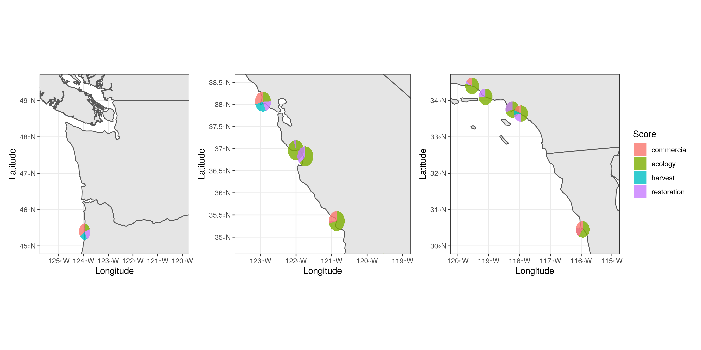

```{r setup, include=FALSE}
knitr::opts_chunk$set(echo = TRUE)
```

```{r, include=FALSE}
#Loading packages

library(scatterpie)
library(janitor)
library(here)
library(USAboundaries)
library(sf)
library(tidyverse)
library(ggplot2)
library(patchwork)
library(mapview)
library(leaflet)
library(leafpop)
library(RColorBrewer)
library(leaflet.minicharts)

```

```{r}
#data tyding and map info from Robert's markdown file

data_goals <- read_csv(here("data", "data_goals.csv"))
scores_clean <- read_csv(here("data", "scores_clean.csv"))

data_scores <- full_join(data_goals, scores_clean) %>%
  clean_names()

estuary_sf <- data_scores %>%
  drop_na("long") %>%
  st_as_sf(coords = c("long", "lat"), crs = 4326) %>%
  clean_names()

SNAPP_estuary_points <- read_sf(dsn = here("locations"), layer = "FINAL_SNAPP_ESTUARIES_POINTS-44")

high_ecology_points <- SNAPP_estuary_points %>%
  filter(Ecol1 >= 0.5)

SNAPP_estuary_polygons <- read_sf(dsn = here("locations"), layer = "FINAL_SNAPP_ESTUARIES_POLYGONS-66")

ca_counties <- read_sf(dsn = here("locations"), layer = "CA_counties")
or_counties <- read_sf(dsn = here("locations"), layer = "OR_counties")
wa_counties <- read_sf(dsn = here("locations"), layer = "WA_counties")
nv_counties <- read_sf(dsn = here("locations"), layer = "NV_counties")

#Reading in shapefiles for Canada and Mexico
canada <- read_sf(dsn = here("locations"), layer = "lpr_000b16a_e")
#st_crs(canada) #EPSG: 9001
# We need to reproject the Canada layer
canada <- st_transform(canada, crs = st_crs(or_counties))

mexico <- read_sf(dsn = here("locations"), layer = "mexstates")
# st_crs(mexico) #EPSG: 4326

```
 
```{r}
#Using scatterpie to put piecharts over map

#need wide format data
pie_data <- high_ecology_points %>%
  select(-NCEASmap) %>%
  rename(ecology = Ecol1, restoration = Resto1, harvest = Harvest1, commercial = Comm1) %>%
  as.data.frame()

```

```{r scatterpie}

#using the scores from the 10 estuary/subbasins with radius proportional to Ecological score
pie_data$radius <- pie_data$ecology/2.5

Zoom_pie_1 <-  ggplot() +
  geom_sf(data = us_boundaries()) +
  geom_sf(data = canada) + 
  geom_scatterpie(aes(x = Longitude, y = Latitude, group = Name, r = radius), data = pie_data, 
                  cols = c("restoration", "harvest", "commercial"), color=NA, alpha=.8, show.legend = FALSE) +
  # geom_scatterpie_legend(pie_data$radius, x=-121.5, y=49) +
  coord_sf(xlim = c(-125.5, -121), ylim = c(45, 49.5)) +
  theme_bw()

Zoom_pie_2 <- ggplot() +
  geom_sf(data = us_boundaries()) +
  geom_scatterpie(aes(x = Longitude, y = Latitude, group = Name, r = radius), data = pie_data, 
                    cols = c("restoration", "harvest", "commercial"), color=NA, alpha=.8, show.legend = FALSE) +
  # geom_scatterpie_legend(pie_data$radius, x=-119.5, y=38) +
  coord_sf(xlim = c(-123.5, -119), ylim = c(34.85, 38.5)) +
  theme_bw()

Zoom_pie_3 <- ggplot() +
  geom_sf(data = us_boundaries()) +
  geom_sf(data = mexico) +
  geom_scatterpie(aes(x = Longitude, y = Latitude, group = Name, r = radius), data = pie_data, 
                    cols = c("restoration", "harvest", "commercial"), color=NA, alpha=.8, legend_name = "Score") +
  geom_scatterpie_legend(pie_data$radius, x=-119.5, y=30.5, ) +
  coord_sf(xlim = c(-120, -115), ylim = c(30, 34.5)) +
  theme_bw()


# put it together
Zoom_pie_ecol_rad <- Zoom_pie_1 + Zoom_pie_2 + Zoom_pie_3
ggsave("figures/final_map_pie_ecol_rad.png", Zoom_pie_ecol_rad, width = 12, height = 6, dpi = 300)

```

```{r, scatterpie all, fig.align="center",  echo=FALSE}
#knitr::include_graphics("figures/final_map_pie_ecol_rad.png")
```

```{r scatterpied fixed}
#using a fixed radius

pie_data$radius <- .225

Zoom_pie_1_fix <-  ggplot() +
  geom_sf(data = us_boundaries()) +
  geom_sf(data = canada) + 
  geom_scatterpie(aes(x = Longitude, y = Latitude, group = Name, r = radius), data = pie_data, 
                  cols = c("ecology", "restoration", "harvest", "commercial"), color=NA, alpha=.8, show.legend = FALSE) +
  coord_sf(xlim = c(-125.5, -120), ylim = c(45, 49.5)) +
  theme_bw()

Zoom_pie_2_fix <- ggplot() +
  geom_sf(data = us_boundaries()) +
  geom_scatterpie(aes(x = Longitude, y = Latitude, group = Name, r = radius), data = pie_data, 
                    cols = c("ecology", "restoration", "harvest", "commercial"), color=NA, alpha=.8, show.legend = FALSE) +
  coord_sf(xlim = c(-123.5, -119), ylim = c(34.8, 38.5)) +
  theme_bw()

Zoom_pie_3_fix <- ggplot() +
  geom_sf(data = us_boundaries()) +
  geom_sf(data = mexico) +
  geom_scatterpie(aes(x = Longitude, y = Latitude, group = Name, r = radius), data = pie_data, 
                    cols = c("ecology", "restoration", "harvest", "commercial"), color=NA, alpha=.8, legend_name = "Score") +
  coord_sf(xlim = c(-120, -115), ylim = c(30, 34.5)) +
  theme_bw()

# put it together
Zoom_pie_ecol_rad_fixed <- Zoom_pie_1_fix + Zoom_pie_2_fix + Zoom_pie_3_fix
ggsave("figures/final_map_pie_ecol_rad_fixed.png", Zoom_pie_ecol_rad_fixed, width = 12, height = 6, dpi = 300)


```

```{r, scatterpie all fixed, fig.align="center",  echo=FALSE}
#
```

```{r}

#testing changing alpha to better view overlapping sites

high_ecology_rest_alpha <- ggplot() +
  geom_sf(data = us_boundaries()) +
  geom_sf(data = canada) +
  geom_sf(data = mexico) +
  geom_sf(data = high_ecology_points, aes(color = Resto1), size = 4, alpha = 0.75) +  
  coord_sf(xlim = c(-130, -115), ylim = c(30, 53)) +
  scale_x_continuous(breaks = c(-130, -116)) +
  scale_y_continuous(breaks = c(30, 40, 50)) +
  theme_bw()

high_ecology_rest_alpha

```


```{r projection changed - proportional radius}
# Made scatterplots round by using different map data

world_map <- map_data("world")

pie_data$radius <- pie_data$ecology/2.5

Zoom_1_round <- ggplot(world_map, aes(x = long, y = lat, group = group)) +
  geom_polygon(fill="lightgray", colour = "black", lwd = 0.25)+
  geom_scatterpie(aes(x = Longitude, y = Latitude, group = Name, r = radius), data = pie_data, cols = c("restoration", "harvest", "commercial"), color=NA, alpha=.8, show.legend = FALSE)+
  coord_sf(xlim = c(-125.5, -121), ylim = c(45, 49.5))+
  xlab("Longitude")+
  ylab("Latitude")+
  theme_bw()

Zoom_2_round <- ggplot(world_map, aes(x = long, y = lat, group = group)) +
  geom_polygon(fill="lightgray", colour = "black", lwd = 0.25)+
  geom_scatterpie(aes(x = Longitude, y = Latitude, group = Name, r = radius), data = pie_data, cols = c("restoration", "harvest", "commercial"), color=NA, alpha=.8, show.legend = FALSE)+
coord_sf(xlim = c(-123.5, -119), ylim = c(34.85, 38.5)) +
  xlab("Longitude")+
  ylab("Latitude")+
  theme_bw()

Zoom_3_round <- ggplot(world_map, aes(x = long, y = lat, group = group)) +
  geom_polygon(fill="lightgray", colour = "black", lwd = 0.25)+
  geom_scatterpie(aes(x = Longitude, y = Latitude, group = Name, r = radius), data = pie_data, cols = c("restoration", "harvest", "commercial"), color=NA, alpha=.8, legend_name = "Score")+
geom_scatterpie_legend(pie_data$radius, x=-119.5, y=30.5, ) +
  coord_sf(xlim = c(-120, -115), ylim = c(30, 34.5)) +
   xlab("Longitude")+
  ylab("Latitude")+
  theme_bw()

Zooms_round <-  Zoom_1_round + Zoom_2_round + Zoom_3_round
ggsave("figures/final_map_pie_ecol_rad_round.png", Zooms_round, width = 12, height = 6, dpi = 300)

```

``````{r, scatterpie all round, fig.align="center",  echo=FALSE}
knitr::include_graphics("figures/final_map_pie_ecol_rad_round.png")
```


```{r projection changed - fixed radius}

pie_data$radius <- .225

Zoom_1_fixed_round <- ggplot(world_map, aes(x = long, y = lat, group = group)) +
  geom_polygon(fill="lightgray", colour = "black", lwd = 0.25)+
  geom_scatterpie(aes(x = Longitude, y = Latitude, group = Name, r = radius), data = pie_data, 
                  cols = c("ecology", "restoration", "harvest", "commercial"), color=NA, alpha=.8, show.legend = FALSE) +
  coord_sf(xlim = c(-125.5, -121), ylim = c(45, 49.5))+
  xlab("Longitude")+
  ylab("Latitude")+
  theme_bw()

Zoom_2_fixed_round <- ggplot(world_map, aes(x = long, y = lat, group = group)) +
  geom_polygon(fill="lightgray", colour = "black", lwd = 0.25)+
  geom_scatterpie(aes(x = Longitude, y = Latitude, group = Name, r = radius), data = pie_data, 
                  cols = c("ecology", "restoration", "harvest", "commercial"), color=NA, alpha=.8, show.legend = FALSE) +
  coord_sf(xlim = c(-123.5, -119), ylim = c(34.8, 38.5)) +
  xlab("Longitude")+
  ylab("Latitude")+
  theme_bw()

Zoom_3_fixed_round <- ggplot(world_map, aes(x = long, y = lat, group = group)) +
  geom_polygon(fill="lightgray", colour = "black", lwd = 0.25)+
  geom_scatterpie(aes(x = Longitude, y = Latitude, group = Name, r = radius), data = pie_data, 
                  cols = c("ecology", "restoration", "harvest", "commercial"), color=NA, alpha=.8, legend_name = "Score") +
  coord_sf(xlim = c(-120, -115), ylim = c(30, 34.5)) +
  xlab("Longitude")+
  ylab("Latitude")+
  theme_bw()

# put it together
Zoom_pie_ecol_rad_fixed_round <- Zoom_1_fixed_round + Zoom_2_fixed_round + Zoom_3_fixed_round
ggsave("figures/final_map_pie_ecol_rad_fixed_round.png", Zoom_pie_ecol_rad_fixed_round, width = 12, height = 6, dpi = 300)

```

```{r, scatterpie all fixed, fig.align="center",  echo=FALSE}
knitr::include_graphics("figures/final_map_pie_ecol_rad_fixed_round.png")
```

```{r leaflet map}
#testing out leaflet map for scatterpie plots

#making leaflet using regular points
leaflet_plain <- leaflet(pie_data) %>% 
  addTiles() %>% 
  addMarkers(lng = ~Longitude,
             lat = ~Latitude,
             popup = ~as.character(Name),
             label = ~as.character(Name))

#can add a graph in a pop-out window using popupGraph().  May work best for a Shiny App

#meaningless plot (just for testing)
test_pie <- ggplot(estuary_sf, aes(x = "", y = ecological, fill = estuary_or_subbasin))+
  geom_bar(width = 1, stat = "identity", show.legend = FALSE)+
  coord_polar("y", start=0)

leaflet_graph <- leaflet(pie_data) %>% 
  addTiles() %>% 
  addMarkers(lng = ~Longitude,
             lat = ~Latitude,
             popup = popupGraph(test_pie),
             label = ~as.character(Name))

leaflet_graph

  
```

```{r}
#Adding plot as a popup figure to map

#making plots & saving as svg
for( i in 1:10){
  
  temp_data <- data_scores[i,] %>% #working on the selected row
    dplyr::select(-c(lat, long, coastwide_coservation)) %>% 
    pivot_longer(-estuary_or_subbasin, names_to = "category", values_to = "score")

  test_pie <- ggplot(temp_data, aes(x = "", y = category, fill = score))+
  geom_bar(width = 1, stat = "identity", show.legend = FALSE)+
    coord_polar("y", start=0)
  
  print(test_pie)
  
  #ggsave(test_pie, file=paste0("figures/pie_plot_", i,".svg"), width = 14, height = 10, units = "cm")
}

#trying to view the pie plots as popups
#first tried using just one of the plots for all the points to see if it would work
mapview(estuary_sf,
        popup = popupImage("/figures/pie_plot_1.svg")) #map is created, but images are broken

```


```{r leaflet minicharts with picharts}
#trying leaflet.minicharts: https://cran.r-project.org/web/packages/leaflet.minicharts/vignettes/introduction.html

#need column with totals if we want to sale barcharts
#pie_data$total <- pie_data$ecology  + pie_data$restoration + pie_data$harvest + pie_data$commercial

leaflet_minichart_pie <- leaflet(pie_data) %>% 
  addTiles() %>% 
  addMinicharts(lng = pie_data$Longitude, lat = pie_data$Latitude,
                type = "pie",
                chartdata = pie_data[,c("ecology", "restoration", "harvest", "commercial")],
                #width = 60 * sqrt(pie_data$total) / sqrt(max(pie_data$total)),
                transitionTime = 0)

leaflet_minichart_pie

```
 
```{r leaflet minicharts with barcharts}

leaflet_minichart_bar <- leaflet(pie_data) %>% 
  addTiles() %>% 
  addMinicharts(lng = pie_data$Longitude, lat = pie_data$Latitude,
                chartdata = pie_data[,c("ecology", "restoration", "harvest", "commercial")])

leaflet_minichart_bar

```
 
```{r leaflet minichart with single values}
#can also represent single values as a weighted point, might be good for use in a Shiny App

leaflet_minichart_ecol <- leaflet(pie_data) %>%
  addTiles() %>% 
  addMinicharts(
    lng = pie_data$Longitude, lat = pie_data$Latitude,
    chartdata = pie_data$ecology,
    showLabels = TRUE,
    width = 45
  )

leaflet_minichart_ecol
```
```{r centroids}
#testing where the estuary polygon centroids are in relation to points (use st_centroid)

#st_centroid needs projection (using NAD83/California Albers)
SNAPP_estuary_polygons_NAD83 <- SNAPP_estuary_polygons %>%
  st_transform(crs = 3310)

#creating centroid data
SNAPP_estuary_polygons_NAD83$centroid <- st_centroid(SNAPP_estuary_polygons_NAD83$geometry)

```
  
```{r mapping centroids}

SNAPP_estuary_centroid_points <- ggplot() +
  geom_sf(data = us_boundaries()) +
  geom_sf(data = canada) +
  geom_sf(data = mexico) +
  geom_sf(data = SNAPP_estuary_polygons_NAD83$centroid, color = "red", size = 2) +
  geom_sf(data = SNAPP_estuary_points, color = "blue", size = 1.5)+
  coord_sf(xlim = c(-130, -115), ylim = c(30, 53)) +
  theme_void()

SNAPP_estuary_centroid_points #there is a lot of overlap, but it looks like some of the estuary centroids are not represented by the estuary points file

# I was wondering if some estuaries had multiple polygons for the same estuary:
# length(unique(SNAPP_estuary_polygons$Estuary_Na)) 
# 66 polygons, each for different estuaries

# length(unique(SNAPP_estuary_points$Name)) 
# 44 points, each for different estuaries

```


