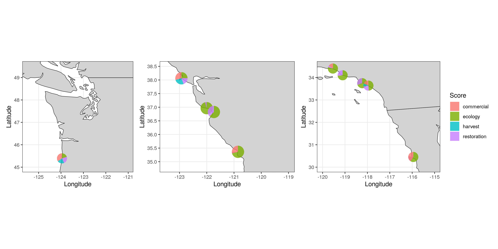

```{r setup, include=FALSE}
knitr::opts_chunk$set(echo = TRUE)
```

```{r, include=FALSE}
#Loading packages

library(scatterpie)
library(janitor)
library(here)
library(USAboundaries)
library(sf)
library(tidyverse)
library(ggplot2)
library(patchwork)
library(mapview)
library(leaflet)
library(leafpop)
library(RColorBrewer)
library(leaflet.minicharts)
library(magick)
library(ggmap)
library(maps)
#remotes::install_github("flowwest/CDECRetrieve")
library(CDECRetrieve)
library(purrr)
library(zoo)
library(ggspatial)

```

```{r}
#data tyding and map info from Robert's markdown file

data_goals <- read_csv(here("data", "data_goals.csv"))
scores_clean <- read_csv(here("data", "scores_clean.csv"))

data_scores <- full_join(data_goals, scores_clean) %>%
  clean_names()

estuary_sf <- data_scores %>%
  drop_na("long") %>%
  st_as_sf(coords = c("long", "lat"), crs = 4326) %>%
  clean_names()

SNAPP_estuary_points <- read_sf(dsn = here("locations"), layer = "FINAL_SNAPP_ESTUARIES_POINTS-44")

high_ecology_points <- SNAPP_estuary_points %>%
  filter(Ecol1 >= 0.5)

SNAPP_estuary_polygons <- read_sf(dsn = here("locations"), layer = "FINAL_SNAPP_ESTUARIES_POLYGONS-66")

ca_counties <- read_sf(dsn = here("locations"), layer = "CA_counties")
or_counties <- read_sf(dsn = here("locations"), layer = "OR_counties")
wa_counties <- read_sf(dsn = here("locations"), layer = "WA_counties")
nv_counties <- read_sf(dsn = here("locations"), layer = "NV_counties")

#Reading in shapefiles for Canada and Mexico
canada <- read_sf(dsn = here("locations"), layer = "lpr_000b16a_e")
#st_crs(canada) #EPSG: 9001
# We need to reproject the Canada layer
canada <- st_transform(canada, crs = st_crs(or_counties))

mexico <- read_sf(dsn = here("locations"), layer = "mexstates")
# st_crs(mexico) #EPSG: 4326

```
 
```{r}
#Using scatterpie to put piecharts over map

#need wide format data
pie_data <- high_ecology_points %>%
  select(-NCEASmap) %>%
  rename(ecology = Ecol1, restoration = Resto1, harvest = Harvest1, commercial = Comm1) %>%
  as.data.frame()

```

```{r scatterpie}

#using the scores from the 10 estuary/subbasins with radius proportional to Ecological score
pie_data$radius <- pie_data$ecology/2.5

Zoom_pie_1 <-  ggplot() +
  geom_sf(data = us_boundaries()) +
  geom_sf(data = canada) + 
  geom_scatterpie(aes(x = Longitude, y = Latitude, group = Name, r = radius), data = pie_data, 
                  cols = c("restoration", "harvest", "commercial"), color=NA, alpha=.8, show.legend = FALSE) +
  # geom_scatterpie_legend(pie_data$radius, x=-121.5, y=49) +
  coord_sf(xlim = c(-125.5, -121), ylim = c(45, 49.5)) +
  theme_bw()

Zoom_pie_2 <- ggplot() +
  geom_sf(data = us_boundaries()) +
  geom_scatterpie(aes(x = Longitude, y = Latitude, group = Name, r = radius), data = pie_data, 
                    cols = c("restoration", "harvest", "commercial"), color=NA, alpha=.8, show.legend = FALSE) +
  # geom_scatterpie_legend(pie_data$radius, x=-119.5, y=38) +
  coord_sf(xlim = c(-123.5, -119), ylim = c(34.85, 38.5)) +
  theme_bw()

Zoom_pie_3 <- ggplot() +
  geom_sf(data = us_boundaries()) +
  geom_sf(data = mexico) +
  geom_scatterpie(aes(x = Longitude, y = Latitude, group = Name, r = radius), data = pie_data, 
                    cols = c("restoration", "harvest", "commercial"), color=NA, alpha=.8, legend_name = "Score") +
  geom_scatterpie_legend(pie_data$radius, x=-119.5, y=30.5, ) +
  coord_sf(xlim = c(-120, -115), ylim = c(30, 34.5)) +
  theme_bw()


# put it together
Zoom_pie_ecol_rad <- Zoom_pie_1 + Zoom_pie_2 + Zoom_pie_3
ggsave("figures/final_map_pie_ecol_rad.png", Zoom_pie_ecol_rad, width = 12, height = 6, dpi = 300)

```

```{r, scatterpie all, fig.align="center",  echo=FALSE}
# knitr::include_graphics("figures/final_map_pie_ecol_rad.png")
```

```{r scatterpied fixed}
#using a fixed radius

pie_data$radius <- .225

Zoom_pie_1_fix <-  ggplot() +
  geom_sf(data = us_boundaries()) +
  geom_sf(data = canada) + 
  geom_scatterpie(aes(x = Longitude, y = Latitude, group = Name, r = radius), data = pie_data, 
                  cols = c("ecology", "restoration", "harvest", "commercial"), color=NA, alpha=.8, show.legend = FALSE) +
  coord_sf(xlim = c(-125.5, -120), ylim = c(45, 49.5)) +
  theme_bw()

Zoom_pie_2_fix <- ggplot() +
  geom_sf(data = us_boundaries()) +
  geom_scatterpie(aes(x = Longitude, y = Latitude, group = Name, r = radius), data = pie_data, 
                    cols = c("ecology", "restoration", "harvest", "commercial"), color=NA, alpha=.8, show.legend = FALSE) +
  coord_sf(xlim = c(-123.5, -119), ylim = c(34.8, 38.5)) +
  theme_bw()

Zoom_pie_3_fix <- ggplot() +
  geom_sf(data = us_boundaries()) +
  geom_sf(data = mexico) +
  geom_scatterpie(aes(x = Longitude, y = Latitude, group = Name, r = radius), data = pie_data, 
                    cols = c("ecology", "restoration", "harvest", "commercial"), color=NA, alpha=.8, legend_name = "Score") +
  coord_sf(xlim = c(-120, -115), ylim = c(30, 34.5)) +
  theme_bw()

# put it together
Zoom_pie_ecol_rad_fixed <- Zoom_pie_1_fix + Zoom_pie_2_fix + Zoom_pie_3_fix
ggsave("figures/final_map_pie_ecol_rad_fixed.png", Zoom_pie_ecol_rad_fixed, width = 12, height = 6, dpi = 300)


```

```{r, scatterpie all fixed, fig.align="center",  echo=FALSE}
# knitr::include_graphics("figures/final_map_pie_ecol_rad_fixed.png")
```

```{r}

#testing changing alpha to better view overlapping sites

high_ecology_rest_alpha <- ggplot() +
  geom_sf(data = us_boundaries()) +
  geom_sf(data = canada) +
  geom_sf(data = mexico) +
  geom_sf(data = high_ecology_points, aes(color = Resto1), size = 4, alpha = 0.75) +  
  coord_sf(xlim = c(-130, -115), ylim = c(30, 53)) +
  scale_x_continuous(breaks = c(-130, -116)) +
  scale_y_continuous(breaks = c(30, 40, 50)) +
  theme_bw()

high_ecology_rest_alpha

```


```{r projection changed - proportional radius}
# Made scatterplots round by using different map data

world_map <- map_data("world")

pie_data$radius <- pie_data$ecology/2.5

Zoom_1_round <- ggplot(world_map, aes(x = long, y = lat, group = group)) +
  geom_polygon(fill="lightgray", colour = "black", lwd = 0.25)+
  geom_scatterpie(aes(x = Longitude, y = Latitude, group = Name, r = radius), data = pie_data, cols = c("restoration", "harvest", "commercial"), color=NA, alpha=.8, show.legend = FALSE)+
  coord_sf(xlim = c(-125.5, -121), ylim = c(45, 49.5))+
  xlab("Longitude")+
  ylab("Latitude")+
  theme_bw()

Zoom_2_round <- ggplot(world_map, aes(x = long, y = lat, group = group)) +
  geom_polygon(fill="lightgray", colour = "black", lwd = 0.25)+
  geom_scatterpie(aes(x = Longitude, y = Latitude, group = Name, r = radius), data = pie_data, cols = c("restoration", "harvest", "commercial"), color=NA, alpha=.8, show.legend = FALSE)+
coord_sf(xlim = c(-123.5, -119), ylim = c(34.85, 38.5)) +
  xlab("Longitude")+
  ylab("Latitude")+
  theme_bw()

Zoom_3_round <- ggplot(world_map, aes(x = long, y = lat, group = group)) +
  geom_polygon(fill="lightgray", colour = "black", lwd = 0.25)+
  geom_scatterpie(aes(x = Longitude, y = Latitude, group = Name, r = radius), data = pie_data, cols = c("restoration", "harvest", "commercial"), color=NA, alpha=.8, legend_name = "Score")+
geom_scatterpie_legend(pie_data$radius, x=-119.5, y=30.5, ) +
  coord_sf(xlim = c(-120, -115), ylim = c(30, 34.5)) +
   xlab("Longitude")+
  ylab("Latitude")+
  theme_bw()

Zooms_round <-  Zoom_1_round + Zoom_2_round + Zoom_3_round
ggsave("figures/final_map_pie_ecol_rad_round.png", Zooms_round, width = 12, height = 6, dpi = 300)

```

``````{r, scatterpie all round, fig.align="center",  echo=FALSE}

```

```{r projection changed - fixed radius}

pie_data$radius <- .225

Zoom_1_fixed_round <- ggplot(world_map, aes(x = long, y = lat, group = group)) +
  geom_polygon(fill="lightgray", colour = "black", lwd = 0.25)+
  geom_scatterpie(aes(x = Longitude, y = Latitude, group = Name, r = radius), data = pie_data, 
                  cols = c("ecology", "restoration", "harvest", "commercial"), color=NA, alpha=.8, show.legend = FALSE) +
  coord_sf(xlim = c(-125.5, -121), ylim = c(45, 49.5))+
  xlab("Longitude")+
  ylab("Latitude")+
  theme_bw()

Zoom_2_fixed_round <- ggplot(world_map, aes(x = long, y = lat, group = group)) +
  geom_polygon(fill="lightgray", colour = "black", lwd = 0.25)+
  geom_scatterpie(aes(x = Longitude, y = Latitude, group = Name, r = radius), data = pie_data, 
                  cols = c("ecology", "restoration", "harvest", "commercial"), color=NA, alpha=.8, show.legend = FALSE) +
  coord_sf(xlim = c(-123.5, -119), ylim = c(34.8, 38.5)) +
  xlab("Longitude")+
  ylab("Latitude")+
  theme_bw()

Zoom_3_fixed_round <- ggplot(world_map, aes(x = long, y = lat, group = group)) +
  geom_polygon(fill="lightgray", colour = "black", lwd = 0.25)+
  geom_scatterpie(aes(x = Longitude, y = Latitude, group = Name, r = radius), data = pie_data, 
                  cols = c("ecology", "restoration", "harvest", "commercial"), color=NA, alpha=.8, legend_name = "Score") +
  coord_sf(xlim = c(-120, -115), ylim = c(30, 34.5)) +
  xlab("Longitude")+
  ylab("Latitude")+
  theme_bw()

# put it together
Zoom_pie_ecol_rad_fixed_round <- Zoom_1_fixed_round + Zoom_2_fixed_round + Zoom_3_fixed_round
ggsave("figures/final_map_pie_ecol_rad_fixed_round.png", Zoom_pie_ecol_rad_fixed_round, width = 12, height = 6, dpi = 300)

```

```{r, scatterpie all fixed, fig.align="center",  echo=FALSE}

```

```{r leaflet map}
#testing out leaflet map for scatterpie plots

#making leaflet using regular points
leaflet_plain <- leaflet(pie_data) %>% 
  addTiles() %>% 
  addMarkers(lng = ~Longitude,
             lat = ~Latitude,
             popup = ~as.character(Name),
             label = ~as.character(Name))

#can add a graph in a pop-out window using popupGraph().  May work best for a Shiny App

#meaningless plot (just for testing)
test_pie <- ggplot(estuary_sf, aes(x = "", y = ecological, fill = estuary_or_subbasin))+
  geom_bar(width = 1, stat = "identity", show.legend = FALSE)+
  coord_polar("y", start=0)

leaflet_graph <- leaflet(pie_data) %>% 
  addTiles() %>% 
  addMarkers(lng = ~Longitude,
             lat = ~Latitude,
             popup = popupGraph(test_pie),
             label = ~as.character(Name))

leaflet_graph

  
```

```{r}
#Adding plot as a popup figure to map

#making plots & saving as svg
for( i in 1:10){
  
  temp_data <- data_scores[i,] %>% #working on the selected row
    dplyr::select(-c(lat, long, coastwide_coservation)) %>% 
    pivot_longer(-estuary_or_subbasin, names_to = "category", values_to = "score")

  test_pie <- ggplot(temp_data, aes(x = "", y = category, fill = score))+
  geom_bar(width = 1, stat = "identity", show.legend = FALSE)+
    coord_polar("y", start=0)
  
  print(test_pie)
  
  #ggsave(test_pie, file=paste0("figures/pie_plot_", i,".svg"), width = 14, height = 10, units = "cm")
}

#trying to view the pie plots as popups
#first tried using just one of the plots for all the points to see if it would work
mapview(estuary_sf,
        popup = popupImage("/figures/pie_plot_1.svg")) #map is created, but images are broken

```

```{r leaflet minicharts with picharts}
#trying leaflet.minicharts: https://cran.r-project.org/web/packages/leaflet.minicharts/vignettes/introduction.html

#need column with totals if we want to sale barcharts
#pie_data$total <- pie_data$ecology  + pie_data$restoration + pie_data$harvest + pie_data$commercial

leaflet_minichart_pie <- leaflet(pie_data) %>% 
  addTiles() %>% 
  addMinicharts(lng = pie_data$Longitude, lat = pie_data$Latitude,
                type = "pie",
                chartdata = pie_data[,c("ecology", "restoration", "harvest", "commercial")],
                #width = 60 * sqrt(pie_data$total) / sqrt(max(pie_data$total)),
                transitionTime = 0)

leaflet_minichart_pie

```
 
```{r leaflet minicharts with barcharts}

bar_cols <- c("#33a02c", "#b2df8a", "#1f78b4", "#a6cee3") #setting the colors for the barcharts

leaflet_minichart_bar <- leaflet(pie_data) %>% 
  addTiles() %>% 
  addProviderTiles("Esri.WorldGrayCanvas") %>% #changing background
  
  addMinicharts(lng = pie_data$Longitude, 
                lat = pie_data$Latitude,
                chartdata = pie_data[,c("ecology", "restoration", "harvest", "commercial")],
                colorPalette = bar_cols,
                width = 45, height = 45)

leaflet_minichart_bar

#setting the zoom
leaflet_minichart_bar_zoom <- leaflet(pie_data) %>% 
  addTiles() %>% 
  addProviderTiles("Esri.WorldGrayCanvas") %>% #changing background
  
  addMinicharts(lng = pie_data$Longitude, 
                lat = pie_data$Latitude,
                chartdata = pie_data[,c("ecology", "restoration", "harvest", "commercial")],
                colorPalette = bar_cols) %>% 
  setView(-121.7379, 36.82495, zoom = 7)

leaflet_minichart_bar_zoom

```
 
```{r leaflet minichart with single values}

#can also represent single values as a weighted point, might be good for use in a Shiny App
leaflet_minichart_ecol <- leaflet(pie_data) %>%
  addTiles() %>% 
  addMinicharts(
    lng = pie_data$Longitude, lat = pie_data$Latitude,
    chartdata = pie_data$ecol,
    showLabels = TRUE,
    width = 45
  )

leaflet_minichart_ecol

#Adding a selector box to leaflet: unfortunately, the minichart function does not support the group argument but I was able to get basically the same result.

leaflet_points <- pie_data %>% #convert zeros to NAs so they do not get plotted on map
  mutate(ecology = na_if(ecology, "0")) %>% 
  mutate(restoration = na_if(restoration, "0")) %>%
  mutate(harvest = na_if(harvest, "0")) %>% 
  mutate(commercial = na_if(commercial, "0"))

point_weight = 20

leaflet_select <- leaflet(leaflet_points) %>%
  addTiles() %>% 
  addProviderTiles("Esri.WorldGrayCanvas") %>% #changing background
  addCircleMarkers(~Longitude, ~Latitude, point_weight*leaflet_points$ecology, 
                   group = "ecology", 
                   stroke = F,
                   fillOpacity = 1,
                   color = "darkcyan",
                   label = leaflet_points$ecology,
                   labelOptions = labelOptions(noHide = T, textOnly = TRUE, direction = "center", style = list(color = "white"))) %>%
  addCircleMarkers(~Longitude, ~Latitude, point_weight*leaflet_points$restoration, 
                   group = "restoration", 
                   stroke = F, 
                   fillOpacity = 1,
                   color = "darkcyan",
                   label = leaflet_points$restoration,
                   labelOptions = labelOptions(noHide = T, textOnly = TRUE, direction = "center", style = list(color = "white"))) %>% 
  addCircleMarkers(~Longitude, ~Latitude, point_weight*leaflet_points$harvest, 
                   group = "harvest", 
                   stroke = F,
                   fillOpacity = 1,
                   color = "darkcyan",
                   label = leaflet_points$harvest,
                   labelOptions = labelOptions(noHide = T, textOnly = TRUE, direction = "center", style = list(color = "white"))) %>% 
  addCircleMarkers(~Longitude, ~Latitude, point_weight*leaflet_points$commercial, 
                   group = "commercial", 
                   stroke = F,
                   fillOpacity = 1,
                   color = "darkcyan",
                   label = leaflet_points$commercial,
                   labelOptions = labelOptions(noHide = T, textOnly = TRUE, direction = "center", style = list(color = "white"))) %>% 
  addLayersControl(
    baseGroups = c("ecology", "restoration", "harvest", "commercial"),
    options = layersControlOptions(collapsed = FALSE)
  )

leaflet_select

```

```{r saving leaflet image}
#trying to save leaflet output as an image

library(plotly)
library(htmlwidgets)
library(webshot)
library(mapview)


# # first method is using webshot()
# saveWidget(leaflet_minichart_bar, "temp.html", selfcontained = FALSE)
# 
# webshot("temp.html", file = "leaflet_test.png",
#         cliprect = "viewport")
# 
# # another method is using mapshot()
# mapshot(leaflet_minichart_bar, file = "leaflet_test.png",
#   remove_controls = c("zoomControl", "layersControl", "homeButton",
#   "scaleBar"))

```


```{r centroids}
#testing where the estuary polygon centroids are in relation to points (use st_centroid)

#st_centroid needs projection (using NAD83/California Albers)
SNAPP_estuary_polygons_NAD83 <- SNAPP_estuary_polygons %>%
  st_transform(crs = 3310)

#creating centroid data
SNAPP_estuary_polygons_NAD83$centroid <- st_centroid(SNAPP_estuary_polygons_NAD83$geometry)

```
  
```{r mapping centroids}

SNAPP_estuary_centroid_points <- ggplot() +
  geom_sf(data = us_boundaries()) +
  geom_sf(data = canada) +
  geom_sf(data = mexico) +
  geom_sf(data = SNAPP_estuary_polygons_NAD83$centroid, color = "red", size = 2) +
  geom_sf(data = SNAPP_estuary_points, color = "blue", size = 1.5)+
  coord_sf(xlim = c(-130, -115), ylim = c(30, 53)) +
  theme_void()

SNAPP_estuary_centroid_points #there is a lot of overlap, but it looks like some of the estuary centroids are not represented by the estuary points file

# I was wondering if some estuaries had multiple polygons for the same estuary:
# length(unique(SNAPP_estuary_polygons$Estuary_Na)) 
# 66 polygons, each for different estuaries

# length(unique(SNAPP_estuary_points$Name)) 
# 44 points, each for different estuaries

```

```{r online example code}

# CDEC station codes to retrieve data for
stations = c('BDL', 'BLL', 'CSE', 'FLT', 'GOD', 'GZL', 'HON', 'HUN',
  'IBS', 'MAL', 'MRZ', 'MSL', 'NSL', 'PCT', 'RYC', 'TEA', 'VOL')

# get station locations
station.locations = map_dfr(stations, cdec_stations) %>%
  transmute(location_id = toupper(station_id), name,
    latitude, longitude)

# get station EC data
station.data = map_dfr(stations, cdec_query, sensor_num = 100L,
  dur_code = "E", start_date = '2016-09-25',
  end_date = '2016-11-05') %>%
  group_by(
    location_id,
    datetime = as.POSIXct(round(datetime, 'hours'))
  ) %>%
  summarize(mean = mean(parameter_value, na.rm = TRUE)) %>%
  mutate(windowmean = rollmean(mean, 25, 'center')) %>%
  ungroup()

# make a separate ggplot for each station
station.plots = station.data %>%
  nest(-location_id) %>%
  mutate(plot = map2(data, location_id,
    ~ ggplot(.x) + ggtitle(.y) + theme_bw(base_size = 8) +
    aes(x = datetime, y = windowmean) + geom_line() +
    scale_x_datetime(NULL, breaks = as.POSIXct(c("2016-10-01",
      "2016-10-15", "2016-10-31")), date_labels = "%b %d",
      limits = as.POSIXct(c("2016-10-01", "2016-10-31"))) +
    scale_y_continuous("Spec. Conductivity",
      limits = c(4000, 30000))
    )
  )

#get station point data
station.points = st_as_sf(station.locations, crs = 4326,
  coords = c("longitude", "latitude")) %>%
  st_transform(3857)

#create annotation
station.annotations = station.points %>%
  bind_cols(as_tibble(st_coordinates(.))) %>%
  st_drop_geometry() %>%
  select(location_id, X, Y) %>%
  left_join(station.plots, by = "location_id") %>%
  mutate(annotation = pmap(list(X, Y, plot),
    ~ annotation_custom(ggplotGrob(..3), #convert each plot to a grob via ggplotGrob 
      xmin = ..1 - 2000, xmax = ..1 + 2000, #explicitly defining the bounding box of each annotation layer.
      ymin = ..2 - 1000, ymax = ..2 + 1000))) %>%
  pull(annotation)

#create map
ggplot(station.points) +
  xlim(c(-13598000, -13563500)) +
  #annotation_map_tile(zoom = 13) +
  station.annotations

  
```


```{r}
library(mapdata)

#Trying to overlay barcharts on a static ggplot map
bar_data <-  data_scores %>%
  drop_na("long") %>% 
  #select(-coastwide_coservation) %>%  
  select(estuary_or_subbasin, lat, long, ecological, harvest, community_engagement_restotation) %>% 
  pivot_longer(-c("estuary_or_subbasin", "lat", "long"), names_to = "category", values_to = "score")

# #normal ggplot for reference
# ggplot(data = bar_data, aes(x = category, y = score))+
#   geom_bar(width = 1, stat = "identity", show.legend = FALSE)+
#   facet_grid(~estuary_or_subbasin)

# make a separate ggplot for each estuary:
test_plots <- bar_data %>% 
  group_by(estuary_or_subbasin) %>% 
  nest() %>%
  mutate(plot = map2(data, estuary_or_subbasin,
                     ~ggplot(data = .x) +
                       aes(x = category, y = score) +
                       geom_bar(stat = "identity", show.legend = FALSE, aes(fill = category)) +
                       theme(axis.title.x=element_blank(), #removing all labels
                             axis.text.x=element_blank(),
                             axis.ticks.x=element_blank(),
                             axis.title.y=element_blank(),
                             axis.text.y=element_blank(),
                             axis.ticks.y=element_blank(),
                             panel.grid.major = element_blank(), panel.grid.minor = element_blank(), #removing grids
                             panel.background = element_rect(fill = "transparent",colour = NA), #making background transparent
                             plot.background = element_rect(fill = "transparent",colour = NA),
                             plot.margin = unit(c(0, 0, 0, 0), "null"))
                          
           )
         )

# get spatial layer to define where the plots will be placed
plot_points <- estuary_sf %>% 
  select(estuary_or_subbasin, geometry)

plot_points <- st_as_sf(plot_points, crs = 4326, coords = c("longitude", "latitude")) #%>%
  # st_transform(3857)

# turn the plots into annotations: 
estuary_annotation <- plot_points %>% 
  bind_cols(as_tibble(st_coordinates(.))) %>% #retrieves coordinates in matrix form as a tibble, and binds into one dataframe
  st_drop_geometry() %>% #removes geometry from sf object
  left_join(test_plots, by = "estuary_or_subbasin") %>% 
  mutate(annotation = pmap(list( X, Y, plot), #creating an annotation column, then using the coordinates and plots in the annotation_custom() function
                           ~annotation_custom(ggplotGrob(..3), # ..3 refers to the third argument, so plot 
                                              xmin = ..1 - 1.5, xmax = ..1 + 1.5, # ..1 refers to X
                                              ymin = ..2 - 1, ymax = ..2 + 1))) %>% # ..2 refers to Y
  pull(annotation)

# make ggplot and add list of notations
ggplot(plot_points) +
  geom_sf(data = us_boundaries()) +
  geom_sf(data = canada) + 
  xlim(c(-130, -115))+
  ylim(c(30, 53))+
  # coord_sf(crs = 4326, xlim = c(-13598000, -13563500), expand = FALSE)+
  # annotation_map_tile(type = "osm", zoom = 13) +
  estuary_annotation

```

Trying ggrepel to prevent overlap using ggrepel::repel_boxes() following example from [here](http://zachcp.org/blog/2016/ggrepelmaps/) and [here](https://github.com/slowkow/ggrepel/issues/24)

```{r}
bar_data <-  data_scores %>%
  drop_na("long") %>% 
  #select(-coastwide_coservation) %>%  
  select(estuary_or_subbasin, lat, long, ecological, harvest, community_engagement_restotation) %>% 
  pivot_longer(-c("estuary_or_subbasin", "lat", "long"), names_to = "category", values_to = "score")

point_data <-  data_scores %>%
  drop_na("long") %>% 
  select(estuary_or_subbasin, lat, long)

library(ggrepel)
library(ggimage)

#' Given a Set of Points and Box sizes, find locations
#' Written by @zachp, updated by @slowkow
findboxes <- function(
  df, xcol, ycol,
  box_padding_x, box_padding_y,
  point_padding_x, point_padding_y,
  xlim, ylim,
  force = 1e-7, maxiter = 20000
) {

  # x and y posiitons as a dataframe
  posdf <- df[c(xcol, ycol)]

  # returnd a df where columns are points
  boxdf <- apply(posdf, 1, function(row) {
    xval <- row[xcol]
    yval <- row[ycol]
    return(c(
      xval - box_padding_x / 2,
      yval - box_padding_y / 2,
      xval + box_padding_x / 2,
      yval + box_padding_y / 2
    ))
  })
  # columns are x1,y1,x2,y2
  boxmatrix <- as.matrix(t(boxdf))

  moved <- ggrepel:::repel_boxes(
    data_points = as.matrix(posdf),
    point_padding_x = point_padding_x,
    point_padding_y = point_padding_y,
    boxes = boxmatrix,
    xlim = xlim,
    ylim = ylim,
    hjust = 0.5,
    vjust = 0.5,
    force = force,
    maxiter = maxiter
  )

  finaldf <- cbind(posdf, moved)
  names(finaldf) <- c("x1", "y1", "x2", "y2")
  return(finaldf)
}

# data frame with two x and two y values
df1 <- findboxes(point_data,
  xcol = "long", ycol = "lat",
  box_padding_x = Reduce("-", rev(range(point_data$lat))) * 1.75,
  box_padding_y = Reduce("-", rev(range(point_data$long))) * 1.75,
  point_padding_x = Reduce("-", rev(range(point_data$long))) * 1,
  point_padding_y = Reduce("-", rev(range(point_data$lat))) * 1,
  force = 1e-10, #force = repulsion
  xlim = c(-130, -115),
  ylim = c(30, 53)
)

#renaming first column to match original bar_data df
colnames(df1)[1] <- "long"

#adding offset values to bar_data
bar_data_offset <- point_data %>%
  left_join(df1, by = "long") %>%
  select(-c(y1)) %>% #removing repeated lat values
  rename(lat_offset = y2, long_offset = x2) #renaming to be more descriptive

# taking offset lat long and creating a geometry
offset_points <- st_as_sf(bar_data_offset, crs = 4326, coords = c("long_offset", "lat_offset")) %>%
  select(estuary_or_subbasin, geometry)

# make a separate ggplot for each estuary:
test_plots <- bar_data %>% 
  group_by(estuary_or_subbasin) %>% 
  nest() %>%
  mutate(plot = map2(data, estuary_or_subbasin,
                     ~ggplot(data = .x) +
                       aes(x = category, y = score) +
                       geom_bar(stat = "identity", show.legend = FALSE, aes(fill = category)) +
                       theme(axis.title.x=element_blank(), #removing all labels
                             axis.text.x=element_blank(),
                             axis.ticks.x=element_blank(),
                             axis.title.y=element_blank(),
                             axis.text.y=element_blank(),
                             axis.ticks.y=element_blank(),
                             panel.grid.major = element_blank(), panel.grid.minor = element_blank(), #removing grids
                             panel.background = element_rect(fill = "transparent",colour = NA), #making background transparent
                             plot.background = element_rect(fill = "transparent",colour = NA),
                             plot.margin = unit(c(0, 0, 0, 0), "null"))
                          
           )
         )

# turn the plots into annotations: 
estuary_annotation <- offset_points %>% 
  bind_cols(as_tibble(st_coordinates(.))) %>% #retrieves coordinates in matrix form as a tibble, and binds into one dataframe
  st_drop_geometry() %>% #removes geometry from sf object
  left_join(test_plots, by = "estuary_or_subbasin") %>% 
  mutate(annotation = pmap(list( X, Y, plot), #creating an annotation column, then using the coordinates and plots in the annotation_custom() function
                           ~annotation_custom(ggplotGrob(..3), # ..3 refers to the third argument, so plot 
                                              xmin = ..1 - 0, xmax = ..1 + 3, # ..1 refers to X
                                              ymin = ..2 - 0, ymax = ..2 + 2))) %>% # ..2 refers to Y
  pull(annotation)

# make ggplot and add list of notations
ggplot(offset_points) +
  geom_sf(data = us_boundaries()) +
  geom_sf(data = canada) + 
  xlim(c(-130, -115))+
  ylim(c(30, 53))+
  geom_segment(data = bar_data_offset, aes(x = long, y = lat, xend = long_offset, yend = lat_offset)) +
  geom_point(data = bar_data_offset, aes(long, lat), color = "black") +
  geom_point(data = bar_data_offset, aes(long_offset, lat_offset), color = "black") +
  estuary_annotation

# #zoom
# ggplot(offset_points) +
#   geom_sf(data = us_boundaries()) +
#   geom_sf(data = canada) + 
#   xlim(c(-125, -121.5))+
#   ylim(c(45, 49.5))+
#   geom_segment(data = bar_data_offset, aes(x = long, y = lat, xend = long_offset, yend = lat_offset)) +
#   geom_point(data = bar_data_offset, aes(long, lat), color = "black") +
#   geom_point(data = bar_data_offset, aes(long_offset, lat_offset), color = "black") +
#   estuary_annotation

```


Trying example from [here](https://stackoverflow.com/questions/59413256/any-way-to-plot-multiple-barplots-on-a-map)

```{r}
mp <-  NULL
mapWorld <- borders("world", colour="gray70", fill="gray70") 

fig <- image_graph(width = 850, height = 550, res = 96)
ggplot()+ 
  mapWorld+
  coord_cartesian(xlim = c(-120, -115), ylim = c(30, 34.5)) #setting zoom

temp_data <- data_scores[1,] %>% #working on the selected row
    dplyr::select(-c(lat, long, coastwide_coservation)) %>% 
    pivot_longer(-estuary_or_subbasin, names_to = "category", values_to = "score")

temp_plot <- ggplot(data = temp_data, aes(x = category, y = score))+
  geom_bar(width = 1, stat = "identity", show.legend = FALSE)+
  theme_bw()+
  theme(legend.position = "none", axis.title.x = element_blank(), axis.title.y = element_blank())

barfig1 <- image_graph(width = 100, height = 75, res = 72)
temp_plot
  
final <- image_composite(fig, barfig1, offset = "+425+275") #offset is in pixels so I think they will need to be manually placed
  
print(final)

```

