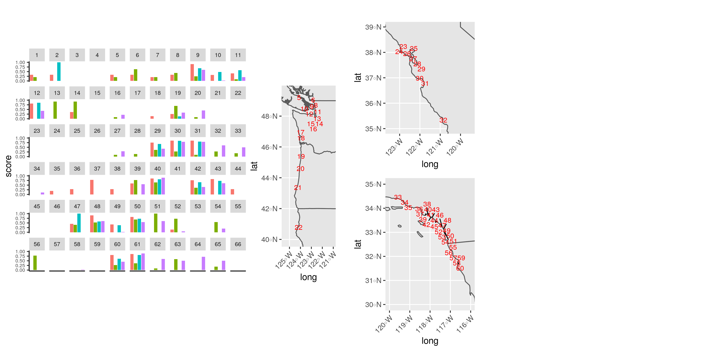

```{r setup, include=FALSE}
knitr::opts_chunk$set(echo = TRUE)
```

```{r, include=FALSE}
#Loading packages

library(scatterpie)
library(janitor)
library(here)
library(USAboundaries)
library(sf)
library(tidyverse)
library(ggplot2)
library(patchwork)
library(mapview)
library(leaflet)
library(leafpop)
library(RColorBrewer)
library(leaflet.minicharts)
library(magick)
library(ggmap)
library(maps)
#remotes::install_github("flowwest/CDECRetrieve")
#library(CDECRetrieve)
library(purrr)
library(zoo)
library(ggspatial)
library(patchwork)
library(cowplot)
library(ggpubr)
library(ggrepel)
library(mapdata)
library(ggrepel)
library(ggimage)

```

```{r, include=FALSE}
#data tyding and map info from Robert's markdown file

#data from Robert
data_goals <- read_csv(here("data", "data_goals.csv"))

scores_clean <- read_csv(here("data", "scores_clean.csv"))

data_scores <- full_join(data_goals, scores_clean) %>%
  clean_names()

estuary_sf <- data_scores %>%
  drop_na("long") %>%
  st_as_sf(coords = c("long", "lat"), crs = 4326) %>%
  clean_names()

#spatial data from working group
SNAPP_estuary_points <- read_sf(dsn = here("locations"), layer = "FINAL_SNAPP_ESTUARIES_POINTS-44")

high_ecology_points <- SNAPP_estuary_points %>%
  filter(Ecol1 >= 0.5)

SNAPP_estuary_polygons <- read_sf(dsn = here("locations"), layer = "FINAL_SNAPP_ESTUARIES_POLYGONS-66")

# map layers from Robert's code
ca_counties <- read_sf(dsn = here("locations"), layer = "CA_counties")
or_counties <- read_sf(dsn = here("locations"), layer = "OR_counties")
wa_counties <- read_sf(dsn = here("locations"), layer = "WA_counties")
nv_counties <- read_sf(dsn = here("locations"), layer = "NV_counties")

#Reading in shapefiles for Canada and Mexico
canada <- read_sf(dsn = here("locations"), layer = "lpr_000b16a_e")
#st_crs(canada) #EPSG: 9001
# We need to reproject the Canada layer
canada <- st_transform(canada, crs = st_crs(or_counties))

mexico <- read_sf(dsn = here("locations"), layer = "mexstates")
# st_crs(mexico) #EPSG: 4326

```
 
### Scatterpie:

```{r scatterpie}

#Using scatterpie to put piecharts over map

#need wide format data
pie_data <- high_ecology_points %>%
  select(-NCEASmap) %>%
  rename(ecology = Ecol1, restoration = Resto1, harvest = Harvest1, commercial = Comm1) %>%
  as.data.frame()

#using the scores from the 10 estuary/subbasins with radius proportional to Ecological score
pie_data$radius <- pie_data$ecology/2.5

Zoom_pie_1 <-  ggplot() +
  geom_sf(data = us_boundaries()) +
  geom_sf(data = canada) + 
  geom_scatterpie(aes(x = Longitude, y = Latitude, group = Name, r = radius), data = pie_data, 
                  cols = c("restoration", "harvest", "commercial"), color=NA, alpha=.8, show.legend = FALSE) +
  # geom_scatterpie_legend(pie_data$radius, x=-121.5, y=49) +
  coord_sf(xlim = c(-125.5, -121), ylim = c(45, 49.5)) +
  theme_bw()

Zoom_pie_2 <- ggplot() +
  geom_sf(data = us_boundaries()) +
  geom_scatterpie(aes(x = Longitude, y = Latitude, group = Name, r = radius), data = pie_data, 
                    cols = c("restoration", "harvest", "commercial"), color=NA, alpha=.8, show.legend = FALSE) +
  # geom_scatterpie_legend(pie_data$radius, x=-119.5, y=38) +
  coord_sf(xlim = c(-123.5, -119), ylim = c(34.85, 38.5)) +
  theme_bw()

Zoom_pie_3 <- ggplot() +
  geom_sf(data = us_boundaries()) +
  geom_sf(data = mexico) +
  geom_scatterpie(aes(x = Longitude, y = Latitude, group = Name, r = radius), data = pie_data, 
                    cols = c("restoration", "harvest", "commercial"), color=NA, alpha=.8, legend_name = "Score") +
  geom_scatterpie_legend(pie_data$radius, x=-119.5, y=30.5, ) +
  coord_sf(xlim = c(-120, -115), ylim = c(30, 34.5)) +
  theme_bw()

# put it together
Zoom_pie_ecol_rad <- Zoom_pie_1 + Zoom_pie_2 + Zoom_pie_3
ggsave("figures/final_map_pie_ecol_rad.png", Zoom_pie_ecol_rad, width = 12, height = 6, dpi = 300)

```

```{r, scatterpie all, fig.align="center",  echo=FALSE}

```

#### Scatterpie with fixed radius

```{r scatterpied fixed}
#using a fixed radius

pie_data$radius <- .225

Zoom_pie_1_fix <-  ggplot() +
  geom_sf(data = us_boundaries()) +
  geom_sf(data = canada) + 
  geom_scatterpie(aes(x = Longitude, y = Latitude, group = Name, r = radius), data = pie_data, 
                  cols = c("ecology", "restoration", "harvest", "commercial"), color=NA, alpha=.8, show.legend = FALSE) +
  coord_sf(xlim = c(-125.5, -120), ylim = c(45, 49.5)) +
  theme_bw()

Zoom_pie_2_fix <- ggplot() +
  geom_sf(data = us_boundaries()) +
  geom_scatterpie(aes(x = Longitude, y = Latitude, group = Name, r = radius), data = pie_data, 
                    cols = c("ecology", "restoration", "harvest", "commercial"), color=NA, alpha=.8, show.legend = FALSE) +
  coord_sf(xlim = c(-123.5, -119), ylim = c(34.8, 38.5)) +
  theme_bw()

Zoom_pie_3_fix <- ggplot() +
  geom_sf(data = us_boundaries()) +
  geom_sf(data = mexico) +
  geom_scatterpie(aes(x = Longitude, y = Latitude, group = Name, r = radius), data = pie_data, 
                    cols = c("ecology", "restoration", "harvest", "commercial"), color=NA, alpha=.8, legend_name = "Score") +
  coord_sf(xlim = c(-120, -115), ylim = c(30, 34.5)) +
  theme_bw()

# put it together
Zoom_pie_ecol_rad_fixed <- Zoom_pie_1_fix + Zoom_pie_2_fix + Zoom_pie_3_fix
ggsave("figures/final_map_pie_ecol_rad_fixed.png", Zoom_pie_ecol_rad_fixed, width = 12, height = 6, dpi = 300)


```

```{r, scatterpie all fixed 1, fig.align="center",  echo=FALSE}
knitr::include_graphics("figures/final_map_pie_ecol_rad_fixed.png")
```

```{r}
#testing changing alpha to better view overlapping sites

high_ecology_rest_alpha <- ggplot() +
  geom_sf(data = us_boundaries()) +
  geom_sf(data = canada) +
  geom_sf(data = mexico) +
  geom_sf(data = high_ecology_points, aes(color = Resto1), size = 4, alpha = 0.75) +  
  coord_sf(xlim = c(-130, -115), ylim = c(30, 53)) +
  scale_x_continuous(breaks = c(-130, -116)) +
  scale_y_continuous(breaks = c(30, 40, 50)) +
  theme_bw()

high_ecology_rest_alpha

```

#### Scatterpie with radius proportional to ecology score:

```{r projection changed - proportional radius}
# Made scatterplots round by using different map data

world_map <- map_data("world")

pie_data$radius <- pie_data$ecology/2.5

Zoom_1_round <- ggplot(world_map, aes(x = long, y = lat, group = group)) +
  geom_polygon(fill="lightgray", colour = "black", lwd = 0.25)+
  geom_scatterpie(aes(x = Longitude, y = Latitude, group = Name, r = radius), data = pie_data, cols = c("restoration", "harvest", "commercial"), color=NA, alpha=.8, show.legend = FALSE)+
  coord_sf(xlim = c(-125.5, -121), ylim = c(45, 49.5))+
  xlab("Longitude")+
  ylab("Latitude")+
  theme_bw()

Zoom_2_round <- ggplot(world_map, aes(x = long, y = lat, group = group)) +
  geom_polygon(fill="lightgray", colour = "black", lwd = 0.25)+
  geom_scatterpie(aes(x = Longitude, y = Latitude, group = Name, r = radius), data = pie_data, cols = c("restoration", "harvest", "commercial"), color=NA, alpha=.8, show.legend = FALSE)+
coord_sf(xlim = c(-123.5, -119), ylim = c(34.85, 38.5)) +
  xlab("Longitude")+
  ylab("Latitude")+
  theme_bw()

Zoom_3_round <- ggplot(world_map, aes(x = long, y = lat, group = group)) +
  geom_polygon(fill="lightgray", colour = "black", lwd = 0.25)+
  geom_scatterpie(aes(x = Longitude, y = Latitude, group = Name, r = radius), data = pie_data, cols = c("restoration", "harvest", "commercial"), color=NA, alpha=.8, legend_name = "Score")+
geom_scatterpie_legend(pie_data$radius, x=-119.5, y=30.5, ) +
  coord_sf(xlim = c(-120, -115), ylim = c(30, 34.5)) +
   xlab("Longitude")+
  ylab("Latitude")+
  theme_bw()

Zooms_round <-  Zoom_1_round + Zoom_2_round + Zoom_3_round
ggsave("figures/final_map_pie_ecol_rad_round.png", Zooms_round, width = 12, height = 6, dpi = 300)

```

``````{r, scatterpie all round, fig.align="center",  echo=FALSE}
knitr::include_graphics("figures/final_map_pie_ecol_rad_round.png")
```

#### Updated scatterpie with fixed radius

```{r projection changed - fixed radius}

pie_data$radius <- .225

Zoom_1_fixed_round <- ggplot(world_map, aes(x = long, y = lat, group = group)) +
  geom_polygon(fill="lightgray", colour = "black", lwd = 0.25)+
  geom_scatterpie(aes(x = Longitude, y = Latitude, group = Name, r = radius), data = pie_data, 
                  cols = c("ecology", "restoration", "harvest", "commercial"), color=NA, alpha=.8, show.legend = FALSE) +
  coord_sf(xlim = c(-125.5, -121), ylim = c(45, 49.5))+
  xlab("Longitude")+
  ylab("Latitude")+
  theme_bw()

Zoom_2_fixed_round <- ggplot(world_map, aes(x = long, y = lat, group = group)) +
  geom_polygon(fill="lightgray", colour = "black", lwd = 0.25)+
  geom_scatterpie(aes(x = Longitude, y = Latitude, group = Name, r = radius), data = pie_data, 
                  cols = c("ecology", "restoration", "harvest", "commercial"), color=NA, alpha=.8, show.legend = FALSE) +
  coord_sf(xlim = c(-123.5, -119), ylim = c(34.8, 38.5)) +
  xlab("Longitude")+
  ylab("Latitude")+
  theme_bw()

Zoom_3_fixed_round <- ggplot(world_map, aes(x = long, y = lat, group = group)) +
  geom_polygon(fill="lightgray", colour = "black", lwd = 0.25)+
  geom_scatterpie(aes(x = Longitude, y = Latitude, group = Name, r = radius), data = pie_data, 
                  cols = c("ecology", "restoration", "harvest", "commercial"), color=NA, alpha=.8, legend_name = "Score") +
  coord_sf(xlim = c(-120, -115), ylim = c(30, 34.5)) +
  xlab("Longitude")+
  ylab("Latitude")+
  theme_bw()

# put it together
Zoom_pie_ecol_rad_fixed_round <- Zoom_1_fixed_round + Zoom_2_fixed_round + Zoom_3_fixed_round
ggsave("figures/final_map_pie_ecol_rad_fixed_round.png", Zoom_pie_ecol_rad_fixed_round, width = 12, height = 6, dpi = 300)

```

```{r, scatterpie all fixed 2, fig.align="center",  echo=FALSE}
knitr::include_graphics("figures/final_map_pie_ecol_rad_fixed_round.png")
```

### Leaflet Maps:

#### Using leaflet with pop-up windows of pie charts

```{r leaflet map}
#testing out leaflet map for scatterpie plots

#making leaflet using regular points
leaflet_plain <- leaflet(pie_data) %>% 
  addTiles() %>% 
  addMarkers(lng = ~Longitude,
             lat = ~Latitude,
             popup = ~as.character(Name),
             label = ~as.character(Name))

#can add a graph in a pop-out window using popupGraph().  May work best for a Shiny App

#meaningless plot (just for testing)
test_pie <- ggplot(estuary_sf, aes(x = "", y = ecological, fill = estuary_or_subbasin))+
  geom_bar(width = 1, stat = "identity", show.legend = FALSE)+
  coord_polar("y", start=0)

leaflet_graph <- leaflet(pie_data) %>% 
  addTiles() %>% 
  addMarkers(lng = ~Longitude,
             lat = ~Latitude,
             popup = popupGraph(test_pie),
             label = ~as.character(Name))

leaflet_graph
  
```

```{r, map with popup}
#Adding plot as a popup figure to map

#making plots & saving as svg
for( i in 1:10){
  
  temp_data <- data_scores[i,] %>% #working on the selected row
    dplyr::select(-c(lat, long, coastwide_coservation)) %>% 
    pivot_longer(-estuary_or_subbasin, names_to = "category", values_to = "score")

  test_pie <- ggplot(temp_data, aes(x = "", y = category, fill = score))+
  geom_bar(width = 1, stat = "identity", show.legend = FALSE)+
    coord_polar("y", start=0)
  
  # print(test_pie)
  
  #ggsave(test_pie, file=paste0("figures/pie_plot_", i,".svg"), width = 14, height = 10, units = "cm")
}

#trying to view the pie plots as popups
#first tried using just one of the plots for all the points to see if it would work
mapview(estuary_sf,
        popup = popupImage("/figures/pie_plot_1.svg")) #map is created, but images are broken

```

#### Using leaflet minicharts:
##### Pie charts:

```{r leaflet minicharts with picharts}
#trying leaflet.minicharts: https://cran.r-project.org/web/packages/leaflet.minicharts/vignettes/introduction.html

#need column with totals if we want to sale barcharts
#pie_data$total <- pie_data$ecology  + pie_data$restoration + pie_data$harvest + pie_data$commercial

leaflet_minichart_pie <- leaflet(pie_data) %>% 
  addTiles() %>% 
  addMinicharts(lng = pie_data$Longitude, lat = pie_data$Latitude,
                type = "pie",
                chartdata = pie_data[,c("ecology", "restoration", "harvest", "commercial")],
                #width = 60 * sqrt(pie_data$total) / sqrt(max(pie_data$total)),
                transitionTime = 0)

leaflet_minichart_pie

```

##### Bar charts:
 
```{r leaflet minicharts with barcharts}

bar_cols <- c("#33a02c", "#b2df8a", "#1f78b4", "#a6cee3") #setting the colors for the barcharts

leaflet_minichart_bar <- leaflet(pie_data) %>% 
  addTiles() %>% 
  addProviderTiles("Esri.WorldGrayCanvas") %>% #changing background
  
  addMinicharts(lng = pie_data$Longitude, 
                lat = pie_data$Latitude,
                chartdata = pie_data[,c("ecology", "restoration", "harvest", "commercial")],
                colorPalette = bar_cols,
                width = 45, height = 45)

leaflet_minichart_bar

#setting the zoom
leaflet_minichart_bar_zoom <- leaflet(pie_data) %>% 
  addTiles() %>% 
  addProviderTiles("Esri.WorldGrayCanvas") %>% #changing background
  
  addMinicharts(lng = pie_data$Longitude, 
                lat = pie_data$Latitude,
                chartdata = pie_data[,c("ecology", "restoration", "harvest", "commercial")],
                colorPalette = bar_cols) %>% 
  setView(-121.7379, 36.82495, zoom = 7)

leaflet_minichart_bar_zoom

```
 
##### Displaying single values:
 
```{r leaflet minichart with single values}

#can also represent single values as a weighted point, might be good for use in a Shiny App
leaflet_minichart_ecol <- leaflet(pie_data) %>%
  addTiles() %>% 
  addMinicharts(
    lng = pie_data$Longitude, lat = pie_data$Latitude,
    chartdata = pie_data$ecol,
    showLabels = TRUE,
    width = 45
  )

leaflet_minichart_ecol

#Adding a selector box to leaflet: unfortunately, the minichart function does not support the group argument but I was able to get basically the same result.

leaflet_points <- pie_data %>% #convert zeros to NAs so they do not get plotted on map
  mutate(ecology = na_if(ecology, "0")) %>% 
  mutate(restoration = na_if(restoration, "0")) %>%
  mutate(harvest = na_if(harvest, "0")) %>% 
  mutate(commercial = na_if(commercial, "0"))

point_weight = 20

leaflet_select <- leaflet(leaflet_points) %>%
  addTiles() %>% 
  addProviderTiles("Esri.WorldGrayCanvas") %>% #changing background
  addCircleMarkers(~Longitude, ~Latitude, point_weight*leaflet_points$ecology, 
                   group = "ecology", 
                   stroke = F,
                   fillOpacity = 1,
                   color = "darkcyan",
                   label = leaflet_points$ecology,
                   labelOptions = labelOptions(noHide = T, textOnly = TRUE, direction = "center", style = list(color = "white"))) %>%
  addCircleMarkers(~Longitude, ~Latitude, point_weight*leaflet_points$restoration, 
                   group = "restoration", 
                   stroke = F, 
                   fillOpacity = 1,
                   color = "darkcyan",
                   label = leaflet_points$restoration,
                   labelOptions = labelOptions(noHide = T, textOnly = TRUE, direction = "center", style = list(color = "white"))) %>% 
  addCircleMarkers(~Longitude, ~Latitude, point_weight*leaflet_points$harvest, 
                   group = "harvest", 
                   stroke = F,
                   fillOpacity = 1,
                   color = "darkcyan",
                   label = leaflet_points$harvest,
                   labelOptions = labelOptions(noHide = T, textOnly = TRUE, direction = "center", style = list(color = "white"))) %>% 
  addCircleMarkers(~Longitude, ~Latitude, point_weight*leaflet_points$commercial, 
                   group = "commercial", 
                   stroke = F,
                   fillOpacity = 1,
                   color = "darkcyan",
                   label = leaflet_points$commercial,
                   labelOptions = labelOptions(noHide = T, textOnly = TRUE, direction = "center", style = list(color = "white"))) %>% 
  addLayersControl(
    baseGroups = c("ecology", "restoration", "harvest", "commercial"),
    options = layersControlOptions(collapsed = FALSE)
  )

leaflet_select

```

```{r test: saving leaflet image}
#testing how to save leaflet output as an image

# library(plotly)
# library(htmlwidgets)
# library(webshot)
# library(mapview)

# # first method is using webshot()
# saveWidget(leaflet_minichart_bar, "temp.html", selfcontained = FALSE)
# 
# webshot("temp.html", file = "leaflet_test.png",
#         cliprect = "viewport")
# 
# # another method is using mapshot()
# mapshot(leaflet_minichart_bar, file = "leaflet_test.png",
#   remove_controls = c("zoomControl", "layersControl", "homeButton",
#   "scaleBar"))

```

### Checking centroid data against point data

```{r centroids}
#testing where the estuary polygon centroids are in relation to points (use st_centroid)

# st_geometry(SNAPP_estuary_polygons)
# SNAPP_estuary_polygons$centroid <- st_centroid(SNAPP_estuary_polygons$geometry)


#st_centroid needs projection (using NAD83/California Albers)
SNAPP_estuary_polygons_NAD83 <- SNAPP_estuary_polygons %>%
  st_transform(crs = 3310)

#creating centroid data
SNAPP_estuary_polygons_centroid <- SNAPP_estuary_polygons

SNAPP_estuary_polygons_centroid$centroid <- st_centroid(SNAPP_estuary_polygons_NAD83$geometry) %>%
  st_transform(crs = 4326) #converting to WSG84 to get back in lat/long

```
  
```{r mapping centroids}

SNAPP_estuary_centroid_points <- ggplot() +
  geom_sf(data = us_boundaries()) +
  geom_sf(data = canada) +
  geom_sf(data = mexico) +
  geom_sf(data = SNAPP_estuary_polygons_NAD83$centroid, color = "red", size = 2) +
  geom_sf(data = SNAPP_estuary_points, color = "blue", size = 1.5)+
  coord_sf(xlim = c(-130, -115), ylim = c(30, 53)) +
  theme_void()

SNAPP_estuary_centroid_points #there is a lot of overlap, but it looks like some of the estuary centroids are not represented by the estuary points file

# I was wondering if some estuaries had multiple polygons for the same estuary:
# length(unique(SNAPP_estuary_polygons$Estuary_Na)) 
# 66 polygons, each for different estuaries

# length(unique(SNAPP_estuary_points$Name)) 
# 44 points, each for different estuaries

```

```{r, testing online example code}

# # CDEC station codes to retrieve data for
# stations = c('BDL', 'BLL', 'CSE', 'FLT', 'GOD', 'GZL', 'HON', 'HUN',
#   'IBS', 'MAL', 'MRZ', 'MSL', 'NSL', 'PCT', 'RYC', 'TEA', 'VOL')
# 
# # get station locations
# station.locations = map_dfr(stations, cdec_stations) %>%
#   transmute(location_id = toupper(station_id), name,
#     latitude, longitude)
# 
# # get station EC data
# station.data = map_dfr(stations, cdec_query, sensor_num = 100L,
#   dur_code = "E", start_date = '2016-09-25',
#   end_date = '2016-11-05') %>%
#   group_by(
#     location_id,
#     datetime = as.POSIXct(round(datetime, 'hours'))
#   ) %>%
#   summarize(mean = mean(parameter_value, na.rm = TRUE)) %>%
#   mutate(windowmean = rollmean(mean, 25, 'center')) %>%
#   ungroup()
# 
# # make a separate ggplot for each station
# station.plots = station.data %>%
#   nest(-location_id) %>%
#   mutate(plot = map2(data, location_id,
#     ~ ggplot(.x) + ggtitle(.y) + theme_bw(base_size = 8) +
#     aes(x = datetime, y = windowmean) + geom_line() +
#     scale_x_datetime(NULL, breaks = as.POSIXct(c("2016-10-01",
#       "2016-10-15", "2016-10-31")), date_labels = "%b %d",
#       limits = as.POSIXct(c("2016-10-01", "2016-10-31"))) +
#     scale_y_continuous("Spec. Conductivity",
#       limits = c(4000, 30000))
#     )
#   )
# 
# #get station point data
# station.points = st_as_sf(station.locations, crs = 4326,
#   coords = c("longitude", "latitude")) %>%
#   st_transform(3857)
# 
# #create annotation
# station.annotations = station.points %>%
#   bind_cols(as_tibble(st_coordinates(.))) %>%
#   st_drop_geometry() %>%
#   select(location_id, X, Y) %>%
#   left_join(station.plots, by = "location_id") %>%
#   mutate(annotation = pmap(list(X, Y, plot),
#     ~ annotation_custom(ggplotGrob(..3), #convert each plot to a grob via ggplotGrob 
#       xmin = ..1 - 2000, xmax = ..1 + 2000, #explicitly defining the bounding box of each annotation layer.
#       ymin = ..2 - 1000, ymax = ..2 + 1000))) %>%
#   pull(annotation)
# 
# #create map
# ggplot(station.points) +
#   xlim(c(-13598000, -13563500)) +
#   #annotation_map_tile(zoom = 13) +
#   station.annotations

```

### Using ggplot annotation method to place barcharts on map:

#### Testing:

```{r, barcharts on map}

#Trying to overlay barcharts on a static ggplot map
bar_data <-  data_scores %>%
  drop_na("long") %>% 
  #select(-coastwide_coservation) %>%  
  select(estuary_or_subbasin, lat, long, ecological, harvest, community_engagement_restotation) %>% 
  pivot_longer(-c("estuary_or_subbasin", "lat", "long"), names_to = "category", values_to = "score")

# #normal ggplot for reference
# ggplot(data = bar_data, aes(x = category, y = score))+
#   geom_bar(width = 1, stat = "identity", show.legend = FALSE)+
#   facet_grid(~estuary_or_subbasin)

# make a separate ggplot for each estuary:
test_plots <- bar_data %>% 
  group_by(estuary_or_subbasin) %>% 
  nest() %>%
  mutate(plot = map2(data, estuary_or_subbasin,
                     ~ggplot(data = .x) +
                       aes(x = category, y = score) +
                       geom_bar(stat = "identity", show.legend = FALSE, aes(fill = category)) +
                       theme(axis.title.x=element_blank(), #removing labels
                             axis.text.x=element_blank(),
                             axis.ticks.x=element_blank(),
                             axis.title.y=element_blank(),
                             axis.text.y=element_blank(),
                             axis.ticks.y=element_blank(),
                             panel.grid.major = element_blank(), panel.grid.minor = element_blank(), #removing grids
                             panel.background = element_rect(fill = "transparent",colour = NA), #making backgrounds transparent
                             plot.background = element_rect(fill = "transparent",colour = NA),
                             plot.margin = unit(c(0, 0, 0, 0), "null"), #removing margins
                             axis.line = element_line() )#adding in black axes lines
                          
           )
         )

# get spatial layer to define where the plots will be placed
plot_points <- estuary_sf %>% 
  select(estuary_or_subbasin, geometry)

plot_points <- st_as_sf(plot_points, crs = 4326, coords = c("longitude", "latitude")) #%>%
  # st_transform(3857)

# turn the plots into annotations: 
estuary_annotation <- plot_points %>% 
  bind_cols(as_tibble(st_coordinates(.))) %>% #retrieves coordinates in matrix form as a tibble, and binds into one dataframe
  st_drop_geometry() %>% #removes geometry from sf object
  left_join(test_plots, by = "estuary_or_subbasin") %>% 
  mutate(annotation = pmap(list( X, Y, plot), #creating an annotation column, then using the coordinates and plots in the annotation_custom() function
                           ~annotation_custom(ggplotGrob(..3), # ..3 refers to the third argument, so plot 
                                              xmin = ..1 - 1.5, xmax = ..1 + 1.5, # ..1 refers to X
                                              ymin = ..2 - 1, ymax = ..2 + 1))) %>% # ..2 refers to Y
  pull(annotation)

# make ggplot and add list of notations
ggplot(plot_points) +
  geom_sf(data = us_boundaries()) +
  geom_sf(data = canada) + 
  xlim(c(-130, -115))+
  ylim(c(30, 53))+
  # coord_sf(crs = 4326, xlim = c(-13598000, -13563500), expand = FALSE)+
  # annotation_map_tile(type = "osm", zoom = 13) +
  estuary_annotation

```

#### Draft of barchart map of 13 high ecology sites for publication:

Using ggrepel to prevent overlap using ggrepel::repel_boxes() following example from [here](http://zachcp.org/blog/2016/ggrepelmaps/) and [here](https://github.com/slowkow/ggrepel/issues/24)

```{r, barcharts on map with offsets}
coords <- as.data.frame(st_coordinates(SNAPP_estuary_polygons_centroid$centroid)) %>%
  dplyr::mutate(estuary_or_subbasin = SNAPP_estuary_polygons_centroid$Estuary_Na) %>% 
  rename(lat = Y, long = X) %>% 
  arrange(desc(lat))

bar_data <- SNAPP_estuary_polygons_centroid %>% 
  select(Estuary_Na, Ecol1, Restor1, Harvest1, Comm1) %>% 
  dplyr::filter(Ecol1 > 0.5) %>% 
  rename(estuary_or_subbasin = Estuary_Na)  %>% 
  left_join(coords, by = "estuary_or_subbasin")

st_geometry(bar_data) <- NULL

coords_high_ecol <- bar_data %>% 
  select(estuary_or_subbasin, lat, long)

bar_data_long <- bar_data %>% 
   pivot_longer(-c("estuary_or_subbasin", "lat", "long"), names_to = "category", values_to = "score")

# bar_data <-  data_scores %>%
#   drop_na("long") %>% 
#   #select(-coastwide_coservation) %>%  
#   select(estuary_or_subbasin, lat, long, ecological, harvest, community_engagement_restotation) %>% 
#   pivot_longer(-c("estuary_or_subbasin", "lat", "long"), names_to = "category", values_to = "score")

point_data <-  data_scores %>%
  drop_na("long") %>%
  select(estuary_or_subbasin, lat, long)

#' Given a Set of Points and Box sizes, find locations
#' Written by @zachp, updated by @slowkow
findboxes <- function(
  df, xcol, ycol,
  box_padding_x, box_padding_y,
  point_padding_x, point_padding_y,
  xlim, ylim,
  force = 1e-7, maxiter = 20000
) {

  # x and y posiitons as a dataframe
  posdf <- df[c(xcol, ycol)]

  # returnd a df where columns are points
  boxdf <- apply(posdf, 1, function(row) {
    xval <- row[xcol]
    yval <- row[ycol]
    return(c(
      xval - box_padding_x / 2,
      yval - box_padding_y / 2,
      xval + box_padding_x / 2,
      yval + box_padding_y / 2
    ))
  })
  # columns are x1,y1,x2,y2
  boxmatrix <- as.matrix(t(boxdf))

  moved <- ggrepel:::repel_boxes(
    data_points = as.matrix(posdf),
    point_padding_x = point_padding_x,
    point_padding_y = point_padding_y,
    boxes = boxmatrix,
    xlim = xlim,
    ylim = ylim,
    hjust = 0.5,
    vjust = 0.5,
    force = force,
    maxiter = maxiter
  )

  finaldf <- cbind(posdf, moved)
  names(finaldf) <- c("x1", "y1", "x2", "y2")
  return(finaldf)
}

# data frame with two x and two y values
df1 <- findboxes(coords_high_ecol,
  xcol = "long", ycol = "lat",
  box_padding_x = Reduce("-", rev(range(point_data$lat))) * .5,
  box_padding_y = Reduce("-", rev(range(point_data$long))) * .55,
  point_padding_x = Reduce("-", rev(range(point_data$long))) * .5,
  point_padding_y = Reduce("-", rev(range(point_data$lat))) * .55,
  force = 1e-3, #force = repulsion
  xlim = c(-120, -112),
  ylim = c(27, 55)
)

#renaming first column to match original bar_data df
colnames(df1)[1] <- "long"

#adding offset values to bar_data
bar_data_offset <- coords_high_ecol %>%
  left_join(df1, by = "long") %>%
  select(-c(y1)) %>% #removing repeated lat values
  rename(lat_offset = y2, long_offset = x2) #renaming to be more descriptive

# taking offset lat long and creating a geometry
offset_points <- st_as_sf(bar_data_offset, crs = 4326, coords = c("long_offset", "lat_offset")) %>%
  select(estuary_or_subbasin, geometry)

# make a separate ggplot for each estuary:
test_plots <- bar_data_long %>% 
  group_by(estuary_or_subbasin) %>% 
  nest() %>%
  mutate(plot = map2(data, estuary_or_subbasin,
                     ~ggplot(data = .x) +
                       aes(x = category, y = score) +
                       geom_bar(stat = "identity", show.legend = FALSE, aes(fill = category)) +
                       ylim(0, 1)+
                       theme(axis.title.x=element_blank(), #removing all labels
                             axis.text.x=element_blank(),
                             axis.ticks.x=element_blank(),
                             axis.title.y=element_blank(),
                             axis.text.y=element_blank(),
                             axis.ticks.y=element_blank(),
                             panel.grid.major = element_blank(), panel.grid.minor = element_blank(), #removing grids
                             panel.background = element_rect(fill = "transparent",colour = NA), #making background transparent
                             plot.background = element_rect(fill = "transparent",colour = NA),
                             plot.margin = unit(c(0, 0, 0, 0), "null"),
                             axis.line = element_line())
           )
         )

# turn the plots into annotations: 
estuary_annotation <- offset_points %>% 
  bind_cols(as_tibble(st_coordinates(.))) %>% #retrieves coordinates in matrix form as a tibble, and binds into one dataframe
  st_drop_geometry() %>% #removes geometry from sf object
  left_join(test_plots, by = "estuary_or_subbasin") %>% 
  mutate(annotation = pmap(list( X, Y, plot), #creating an annotation column, then using the coordinates and plots in the annotation_custom() function
                           ~annotation_custom(ggplotGrob(..3), # ..3 refers to the third argument, so plot 
                                              xmin = ..1 - 0, xmax = ..1 + 3, # ..1 refers to X
                                              ymin = ..2 - 0, ymax = ..2 + 2))) %>% # ..2 refers to Y
  pull(annotation)

#saving legend as separate object
simple_barchart <-ggplot(bar_data_long, aes(score, fill = category))+
         geom_bar()+
  theme(legend.margin = margin(0, 0, 0, 0))+
  theme(
    legend.title = element_text(size = 7),
    legend.text = element_text(size = 7),
    legend.background = element_rect(fill = NA))+
  scale_fill_discrete(name = "Score", labels = c("Commercial Production", "Ecological", "Community Engagement Harvest", "Community Engagement Restoration"))

legend <- get_legend(simple_barchart)
gg_legend <-as_ggplot(legend)

#create final map
bar_charts_offset <- ggplot(offset_points) +
  geom_sf(data = us_boundaries()) +
  geom_sf(data = canada) + 
  xlim(c(-130, -113))+
  ylim(c(27, 55))+
  geom_segment(data = bar_data_offset, aes(x = long, y = lat, xend = long_offset, yend = lat_offset)) +
  geom_point(data = bar_data_offset, aes(long, lat), color = "black") +
  geom_point(data = bar_data_offset, aes(long_offset, lat_offset), color = "black") +
  # geom_bar(data = bar_data_long, aes(score, fill = category))+
  estuary_annotation +
  theme_void()

# bar_charts_offset + (plot_spacer() / (gg_legend + plot_spacer() + plot_spacer())) +plot_layout(nrow=1)

layout <- c(
  area(t = 1, l = 1, b = 9, r = 7),
  area(t = 8, l = 1, b = 8, r = 6)
)

bar_chart_map <- bar_charts_offset + gg_legend + 
  plot_layout(design = layout)

bar_chart_map

```


```{r, include = FALSE}
ggsave("figures/bar_chart_map.png", bar_chart_map, width = 12, height = 6, dpi = 300)
```

Testing example from above but choosing an offset for long:

```{r, barchart on map split left and right}
# 
# # Making two datasets with selecting sites from every other row
# bar_data_1 <-  data_scores[seq(1, nrow(data_scores), 2), ] %>%
#   drop_na("long") %>% 
#   select(estuary_or_subbasin, lat, long, ecological, harvest, community_engagement_restotation) %>% 
#   mutate(long_offset = long - 2)
# 
# bar_data_2 <-  data_scores[seq(2, nrow(data_scores), 2), ] %>%
#   drop_na("long") %>% 
#   select(estuary_or_subbasin, lat, long, ecological, harvest, community_engagement_restotation) %>% 
#   mutate(long_offset = long + 2)
# 
# #merging together
# merged_offset <- bind_rows(bar_data_1, bar_data_2) %>% 
#   mutate(lat_offset = lat)
# 
# # taking offset lat long and creating a geometry
# offset_points <- st_as_sf(merged_offset, crs = 4326, coords = c("long_offset", "lat_offset")) %>%
#   select(estuary_or_subbasin, geometry)
# 
# # make a separate ggplot for each estuary:
# test_plots <- bar_data %>% 
#   group_by(estuary_or_subbasin) %>% 
#   nest() %>%
#   mutate(plot = map2(data, estuary_or_subbasin,
#                      ~ggplot(data = .x) +
#                        aes(x = category, y = score) +
#                        geom_bar(stat = "identity", show.legend = FALSE, aes(fill = category)) +
#                        theme(axis.title.x=element_blank(), #removing all labels
#                              axis.text.x=element_blank(),
#                              axis.ticks.x=element_blank(),
#                              axis.title.y=element_blank(),
#                              axis.text.y=element_blank(),
#                              axis.ticks.y=element_blank(),
#                              panel.grid.major = element_blank(), panel.grid.minor = element_blank(), #removing grids
#                              panel.background = element_rect(fill = "transparent",colour = NA), #making background transparent
#                              plot.background = element_rect(fill = "transparent",colour = NA),
#                              plot.margin = unit(c(0, 0, 0, 0), "null"),
#                              axis.line = element_line())
#                           
#            )
#          )
# 
# # turn the plots into annotations: 
# estuary_annotation <- offset_points %>% 
#   bind_cols(as_tibble(st_coordinates(.))) %>% #retrieves coordinates in matrix form as a tibble, and binds into one dataframe
#   st_drop_geometry() %>% #removes geometry from sf object
#   left_join(test_plots, by = "estuary_or_subbasin") %>% 
#   mutate(annotation = pmap(list( X, Y, plot), #creating an annotation column, then using the coordinates and plots in the annotation_custom() function
#                            ~annotation_custom(ggplotGrob(..3), # ..3 refers to the third argument, so plot 
#                                               xmin = ..1 - 0, xmax = ..1 + 3, # ..1 refers to X
#                                               ymin = ..2 - 0, ymax = ..2 + 2))) %>% # ..2 refers to Y
#   pull(annotation)
# 
# # make ggplot and add list of notations
# ggplot(offset_points) +
#   geom_sf(data = us_boundaries()) +
#   geom_sf(data = canada) + 
#   xlim(c(-130, -115))+
#   ylim(c(30, 53))+
#   geom_segment(data = merged_offset, aes(x = long, y = lat, xend = long_offset, yend = lat_offset)) +
#   geom_point(data = merged_offset, aes(long, lat), color = "black") +
#   geom_point(data = merged_offset, aes(long_offset, lat_offset), color = "black") +
#   estuary_annotation

```

Testing manual offset put through the geom_boxes function:

```{r, manual offsets}
# # Making two datasets with selecting sites from every other row
# bar_data_1 <-  data_scores[seq(1, nrow(data_scores), 2), ] %>%
#   drop_na("long") %>% 
#   select(estuary_or_subbasin, lat, long, ecological, harvest, community_engagement_restotation) %>% 
#   mutate(long_offset = long - 2)
# 
# bar_data_2 <-  data_scores[seq(2, nrow(data_scores), 2), ] %>%
#   drop_na("long") %>% 
#   select(estuary_or_subbasin, lat, long, ecological, harvest, community_engagement_restotation) %>% 
#   mutate(long_offset = long + 2)
# 
# #merging together
# manual_offset <- bind_rows(bar_data_1, bar_data_2) %>% 
#   mutate(lat_offset = lat)
# 
# function_offset <- findboxes(manual_offset,
#   xcol = "long_offset", ycol = "lat_offset",
#   box_padding_x = Reduce("-", rev(range(point_data$lat))) * .75,
#   box_padding_y = Reduce("-", rev(range(point_data$long))) * .5,
#   point_padding_x = Reduce("-", rev(range(point_data$long))) * 1,
#   point_padding_y = Reduce("-", rev(range(point_data$lat))) * 1,
#   force = 1e-2, #force = repulsion
#   xlim = c(-130, -115),
#   ylim = c(30, 53)
# )
# 
# function_offset$estuary_or_subbasin <- manual_offset$estuary_or_subbasin
#   
# function_offset_clean <- function_offset %>% 
#   rename(lat_offset = y2, long_offset = x2) %>% 
#   select(-c(x1, y1))
# 
# #adding offset values to bar_data
# final_offset <- manual_offset %>% 
#   dplyr::select(-c(lat_offset, long_offset)) %>% 
#   merge(function_offset_clean, by = "estuary_or_subbasin")
# 
# # taking offset lat long and creating a geometry
# final_offset_points <- st_as_sf(function_offset_clean, crs = 4326, coords = c("long_offset", "lat_offset")) %>%
#   select(estuary_or_subbasin, geometry)
# 
# # make a separate ggplot for each estuary:
# test_plots <- bar_data %>% 
#   group_by(estuary_or_subbasin) %>% 
#   nest() %>%
#   mutate(plot = map2(data, estuary_or_subbasin,
#                      ~ggplot(data = .x) +
#                        aes(x = category, y = score) +
#                        geom_bar(stat = "identity", show.legend = FALSE, aes(fill = category)) +
#                        theme(axis.title.x=element_blank(), #removing all labels
#                              axis.text.x=element_blank(),
#                              axis.ticks.x=element_blank(),
#                              axis.title.y=element_blank(),
#                              axis.text.y=element_blank(),
#                              axis.ticks.y=element_blank(),
#                              panel.grid.major = element_blank(), panel.grid.minor = element_blank(), #removing grids
#                              panel.background = element_rect(fill = "transparent",colour = NA), #making background transparent
#                              plot.background = element_rect(fill = "transparent",colour = NA),
#                              plot.margin = unit(c(0, 0, 0, 0), "null"),
#                              axis.line = element_line())
#                           
#            )
#          )
# 
# # turn the plots into annotations: 
# estuary_annotation <- final_offset_points %>% 
#   bind_cols(as_tibble(st_coordinates(.))) %>% #retrieves coordinates in matrix form as a tibble, and binds into one dataframe
#   st_drop_geometry() %>% #removes geometry from sf object
#   left_join(test_plots, by = "estuary_or_subbasin") %>% 
#   mutate(annotation = pmap(list( X, Y, plot), #creating an annotation column, then using the coordinates and plots in the annotation_custom() function
#                            ~annotation_custom(ggplotGrob(..3), # ..3 refers to the third argument, so plot 
#                                               xmin = ..1 - 0, xmax = ..1 + 3, # ..1 refers to X
#                                               ymin = ..2 - 0, ymax = ..2 + 2))) %>% # ..2 refers to Y
#   pull(annotation)
# 
# # make ggplot and add list of notations
# ggplot(final_offset_points) +
#   geom_sf(data = us_boundaries()) +
#   geom_sf(data = canada) + 
#   xlim(c(-130, -115))+
#   ylim(c(30, 53))+
#   geom_segment(data = final_offset, aes(x = long, y = lat, xend = long_offset, yend = lat_offset)) +
#   geom_point(data = final_offset, aes(long, lat), color = "black") +
#   geom_point(data = final_offset, aes(long_offset, lat_offset), color = "black") +
#   estuary_annotation

```

Testing example from [here](https://stackoverflow.com/questions/59413256/any-way-to-plot-multiple-barplots-on-a-map):

```{r, example from stack overflow}
mp <-  NULL
mapWorld <- borders("world", colour="gray70", fill="gray70") 

fig <- image_graph(width = 850, height = 550, res = 96)
ggplot()+ 
  mapWorld+
  coord_cartesian(xlim = c(-120, -115), ylim = c(30, 34.5)) #setting zoom

temp_data <- data_scores[1,] %>% #working on the selected row
    dplyr::select(-c(lat, long, coastwide_coservation)) %>% 
    pivot_longer(-estuary_or_subbasin, names_to = "category", values_to = "score")

temp_plot <- ggplot(data = temp_data, aes(x = category, y = score))+
  geom_bar(width = 1, stat = "identity", show.legend = FALSE)+
  theme_bw()+
  theme(legend.position = "none", axis.title.x = element_blank(), axis.title.y = element_blank())

barfig1 <- image_graph(width = 100, height = 75, res = 72)
temp_plot
  
final <- image_composite(fig, barfig1, offset = "+425+275") #offset is in pixels so I think they will need to be manually placed
  
print(final)

```

### Supplemental materials bar chart map:

testing using just the 13 points:
```{r, supplemental figure testing}
#make main map w/ points
coords$ID <- seq.int(nrow(coords))

base_map <- ggplot(coords) +
  geom_sf(data = us_boundaries()) +
  geom_sf(data = canada) + 
  geom_sf(data = mexico) +
  xlim(c(-130, -115))+
  ylim(c(30, 53))+
  # geom_point(aes(long, lat), color = "black")+
  geom_text(aes(long, lat, label = ID))

base_map

#make all the barcharts and save into a list
plot_list <- vector("list", length = 13)

for( i in 1:13){
  temp_data <- bar_data[i,] %>% #working on the selected row
    dplyr::select(-c(lat, long)) %>%
    pivot_longer(-estuary_or_subbasin, names_to = "category", values_to = "score")
  
  # graph_title <- paste(i, ".", temp_data$estuary_or_subbasin) #making title with coordinating number and estuary name

  test_pie <- ggplot(temp_data, aes(x = category, y = score)) +
    geom_bar(stat = "identity", show.legend = FALSE, aes(fill = category)) +
    # ggtitle(graph_title) + #trying to add different title to each
    ylim(0,1)+
    theme(axis.title.x=element_blank(), #removing all labels
          axis.text.x=element_blank(),
          axis.ticks.x=element_blank(),
          axis.title.y=element_blank(),
          axis.text.y=element_blank(),
          axis.ticks.y=element_blank(),
          panel.grid.major = element_blank(), panel.grid.minor = element_blank(), #removing grids
          panel.background = element_rect(fill = "transparent",colour = NA), #making background transparent
          plot.background = element_rect(fill = "transparent",colour = NA),
          plot.margin = unit(c(0, 0, 0, 0), "null"),
          axis.line = element_line())+ 
    coord_fixed(ratio = 3)

    plot_list[[i]] <- test_pie
}

# using patchwork to join together
plot_patch <- wrap_plots(plot_list, ncol = 1, width = 1)

plot_patch 

plot_patch | base_map

#plot_spacer() + plot_patch | base_map

# #joining grobs together to make a map
# ggplot() +
#   coord_equal(xlim = c(0, 28), ylim = c(0, 20), expand = FALSE) +
#   annotation_custom(ggplotGrob(base_map), xmin = 0, xmax = 20, ymin = 0, 
#         ymax = 20)+
#    annotation_custom(ggplotGrob(test_plot_1), xmin = 20, xmax = 28, ymin = 11.25, 
#         ymax = 19)


```

testing different layouts:

```{r}

#saving legend as separate object
simple_barchart_2 <-ggplot(bar_data_long, aes(score, fill = category))+
         geom_bar()+
  theme(legend.margin = margin(0, 0, 0, 0))+
  theme(legend.position = "bottom",
        legend.box = "horizontal")+
  facet_wrap(~ category)

legend_2 <- get_legend(simple_barchart_2)
gg_legend_2 <-as_ggplot(legend_2)

plot_patch <- wrap_plots(plot_list, ncol = 2, width = 1)

plot_patch | base_map

```

#### Trying it with all 66 centroids:

basemap with geom_text repel to reduce overlap (still needs work)
```{r, base map}
base_map <- ggplot(coords) +
  geom_sf(data = us_boundaries()) +
  geom_sf(data = canada) + 
  xlim(c(-130, -115))+
  ylim(c(30, 53))+
  # geom_point(aes(long, lat), color = "black")+
  # geom_text(aes(long, lat, label = ID))+
  geom_text_repel(data = coords, aes(long, lat), 
                  label = coords$ID, 
                  #nudge_x = -126, 
                  size = 3,
                  min.segment.length = 0,
                  point.padding = NA,
                  box.padding = 0
                 )

base_map

```
#### Draft of supplementary bar chart map for 66 sites:

```{r, supplemental figure all sites}
coords$ID <- seq.int(nrow(coords))

base_map <- ggplot(coords) +
  geom_sf(data = us_boundaries()) +
  geom_sf(data = canada) + 
  xlim(c(-130, -115))+
  ylim(c(30, 53)) +
  # geom_point(aes(long, lat), color = "black")+
  # geom_text(aes(long, lat, label = ID))+
  geom_text_repel(data = coords, aes(long, lat), 
                  label = coords$ID, 
                  #nudge_x = -126, 
                  size = 3,
                  min.segment.length = 0,
                  point.padding = NA,
                  box.padding = 0
  )


bar_data_all <- SNAPP_estuary_polygons_centroid %>% 
  select(Estuary_Na, Ecol1, Restor1, Harvest1, Comm1) %>% 
  rename(estuary_or_subbasin = Estuary_Na)  %>% 
  left_join(coords, by = "estuary_or_subbasin") %>% 
  st_drop_geometry() #removes geometry from sf object

plot_list_all <- vector("list", length = 66)

for( i in 1:66){
  temp_data <- bar_data_all[i,] %>% #working on the selected row
    dplyr::select(-c(lat, long, ID)) %>%
    pivot_longer(-estuary_or_subbasin, names_to = "category", values_to = "score")
  
  graph_title <- i

  test_pie <- ggplot(temp_data, aes(x = category, y = score)) +
    geom_bar(stat = "identity", show.legend = FALSE, aes(fill = category)) +
    ggtitle(graph_title) + #trying to add different title to each
    ylim(0,1)+
    theme(plot.title = element_text(size = 6, face = "bold"))+
    theme(axis.title.x = element_blank(), #removing all labels
          axis.text.x = element_blank(),
          axis.ticks.x = element_blank(),
          if (i != 1) {axis.title.y = element_blank()},
          #axis.title.y =  ifelse(i == 1, element_blank(), element_text(size = rel(1.5), angle = 90)),
          #axis.title.y = element_blank(),
          #axis.text.y = element_blank(),
          #axis.ticks.y = element_blank(),
          panel.grid.major = element_blank(), panel.grid.minor = element_blank(), #removing grids
          panel.background = element_rect(fill = "transparent",colour = NA), #making background transparent
          plot.background = element_rect(fill = "transparent",colour = NA),
          plot.margin = unit(c(0, 0, 0, 0), "null"),
          axis.line = element_line()) +
    coord_fixed(ratio = 5)

    plot_list_all[[i]] <- test_pie

}

#saving legend as separate object
simple_barchart_2 <-ggplot(bar_data_long, aes(score, fill = category))+
         geom_bar()+
  theme(legend.margin = margin(0, 0, 0, 0))+
  theme(legend.position = "bottom",
        legend.box = "horizontal")+
  facet_wrap(~ category)

legend_2 <- get_legend(simple_barchart_2)
gg_legend_2 <-as_ggplot(legend_2)

# # using patchwork to join together
# 
# set_1 <- plot_list_all[1:33]
# set_1_patch <- wrap_plots(set_1, ncol = 1)
# 
# set_2 <- plot_list_all[34:66]
# set_2_patch <- wrap_plots(set_2, ncol = 1)
# 
# plot_spacer() + set_1_patch | base_map | set_2_patch + plot_spacer()

```

#### Trying to create barcharts using facet_wrap() instead

```{r}

bar_data_66_long <- SNAPP_estuary_polygons_centroid %>% 
  mutate(ID = row_number()) %>% 
  st_drop_geometry() %>% 
  select(ID, Estuary_Na, Ecol1, Restor1, Harvest1, Comm1) %>% 
  rename(estuary_or_subbasin = Estuary_Na)  %>% 
  #left_join(coords, by = "estuary_or_subbasin") %>% 
  pivot_longer(-c(estuary_or_subbasin, ID), names_to = "category", values_to = "score")

coords$ID <- seq.int(nrow(coords))

all_sites_wrap <- ggplot(bar_data_66_long, aes(x = category, y = score)) +
  geom_bar(stat = "identity", show.legend = FALSE, aes(fill = category)) +
  # ggtitle(graph_title) + #trying to add different title to each
  ylim(0,1)+
  # theme(plot.title = element_text(size = 6, face = "bold"))+
  facet_wrap(~ID, ncol = 11, nrow = 6)+
  theme(axis.title.x = element_blank(), #removing all labels
        axis.text.x = element_blank(),
        axis.ticks.x = element_blank(),
        # if (i != 1) {axis.title.y = element_blank()},
        # axis.title.y =  ifelse(i == 1, element_blank(), element_text(size = rel(1.5), angle = 90)),
        # axis.title.y = element_blank(),
        # axis.text.y = element_blank(),
        # axis.ticks.y = element_blank(),
        #strip.text.x = element_blank(),
        panel.grid.major = element_blank(), panel.grid.minor = element_blank(), #removing grids
        panel.background = element_rect(fill = "transparent",colour = NA), #making background transparent
        plot.background = element_rect(fill = "transparent",colour = NA),
        plot.margin = unit(c(0, 0, 0, 0), "null"),
        axis.line = element_line(),
        strip.text = element_text(size = 7),#changing title font size for face_wrap()
        axis.text.y = element_text(size = 6)) + #changing y-axis font size
  coord_fixed(ratio = 5)

all_sites_wrap

```

#### Making zoomed base maps

```{r}

base_map_zoom_1_data <- coords %>% 
  dplyr::filter(long > -125.5 & long < -121) %>% 
  dplyr::filter(lat > 40 & lat < 49.5 )

base_map_zoom_2_data <- coords %>% 
dplyr::filter(long > -123.5 & long < -119.5) %>% 
  dplyr::filter(lat > 35 & lat < 39 )

base_map_zoom_3_data <- coords %>% 
  dplyr::filter(long < -116 & long > -120) %>% 
  dplyr::filter(lat < 35 & lat > 30)

base_map_zoom_1 <- ggplot(base_map_zoom_1_data) +
  geom_sf(data = us_boundaries()) +
  geom_sf(data = canada) + 
  # geom_point(aes(long, lat), color = "black")+
  coord_sf(xlim = c(-125.5, -121), ylim = c(40, 49.5))+
  # geom_text(aes(long, lat, label = base_map_zoom_1_data$ID, color = "blue"))+
  geom_text_repel(data = base_map_zoom_1_data, aes(long, lat), 
                  label = base_map_zoom_1_data$ID, 
                  color = "red",
                  #nudge_x = -126, 
                  size = 3,
                  min.segment.length = 0,
                  point.padding = NA,
                  box.padding = 0,
                  segment.color = "black"
                 )+
  theme(legend.position = "none",
        axis.text.x = element_text(angle = 45, hjust = 1)) #changing angle of x-axis

base_map_zoom_2 <- ggplot(base_map_zoom_2_data) +
  geom_sf(data = us_boundaries()) +
  geom_sf(data = canada) + 
  # geom_point(aes(long, lat), color = "black")+
  coord_sf(xlim = c(-123.5, -119.5), ylim = c(35, 39))+
  # geom_text(aes(long, lat, label = base_map_zoom_2_data$ID, color = "blue"))+
  geom_text_repel(data = base_map_zoom_2_data, aes(long, lat), 
                  label = base_map_zoom_2_data$ID, 
                  color = "red",
                  #nudge_x = -126, 
                  size = 3,
                  min.segment.length = 0,
                  point.padding = NA,
                  box.padding = 0,
                  segment.color = "black"
                 )+
  theme(legend.position = "none",
        axis.text.x = element_text(angle = 45, hjust = 1)) #changing angle of x-axis)

base_map_zoom_3 <- ggplot(base_map_zoom_3_data) +
  geom_sf(data = us_boundaries()) +
  geom_sf(data = canada) + 
  geom_sf(data = mexico) +
  coord_sf(xlim = c(-120, -116), ylim = c(30, 35))+
  geom_text_repel(data = base_map_zoom_3_data, aes(long, lat), 
                  label = base_map_zoom_3_data$ID, 
                  color = "red",
                  #nudge_x = -126, 
                  size = 3,
                  min.segment.length = 0,
                  point.padding = NA,
                  box.padding = 0,
                  segment.color = "black"
                 )+
  theme(legend.position = "none",
        axis.text.x = element_text(angle = 45, hjust = 1)) #changing angle of x-axis)

```

```{r}
#working on layout

# plot_patch <- wrap_plots(plot_list_all, ncol = 11, nrow = 6, width = 1)

# prelim_barchart_supplement <- (plot_patch | base_map) / gg_legend_2 +
#   plot_layout(heights = c(7, 1))

# (all_sites_wrap / gg_legend_2) + (base_map_zoom_1 | base_map_zoom_2 |  base_map_zoom_3)

# all_sites_wrap + (base_map_zoom_1 / base_map_zoom_2) + base_map_zoom_3
  
# all_sites_wrap + base_map_zoom_1 + base_map_zoom_2 + base_map_zoom_3 +
#   plot_layout(nrow = 1, ncol = 4, widths = c(4, 1, 1, 1))
# 

prelim_barchart_supplement <- (all_sites_wrap) + (base_map_zoom_1) + (base_map_zoom_2 / base_map_zoom_3) +
  plot_layout(nrow = 1, ncol = 4, widths = c(4, 1, 2))

```

```{r, include = FALSE}
ggsave("figures/prelim_barchart_supplement.png", prelim_barchart_supplement, width = 12, height = 6, dpi = 300)
```

```{r, fig.align="center",  echo=FALSE}

```

#### Testing making zoomed-in maps:

```{r}
coords$ID <- seq.int(nrow(coords))

bar_data_zoom_1 <- bar_data_all %>% 
  filter(long >= -125.5 & long <= -121) %>% 
  filter(lat >= 45 & lat <= 49.5)

plot_list_zoom_1 <- vector("list", length = 66)

for( i in 1:14){
  temp_data <- bar_data_zoom_1[i,] %>% #working on the selected row
    dplyr::select(-c(lat, long)) %>%
    pivot_longer(-estuary_or_subbasin, names_to = "category", values_to = "score")
  
  graph_title <- temp_data$estuary_or_subbasin

  test_pie <- ggplot(temp_data, aes(x = category, y = score)) +
    geom_bar(stat = "identity", show.legend = FALSE, aes(fill = category)) +
    ggtitle(graph_title) + #trying to add different title to each
    ylim(0,1)+
    theme(plot.title = element_text(size = 6, face = "bold"))+
    theme(axis.title.x = element_blank(), #removing all labels
          axis.text.x = element_blank(),
          axis.ticks.x = element_blank(),
          axis.title.y = element_blank(),
          axis.text.y = element_blank(),
          axis.ticks.y = element_blank(),
          panel.grid.major = element_blank(), panel.grid.minor = element_blank(), #removing grids
          panel.background = element_rect(fill = "transparent",colour = NA), #making background transparent
          plot.background = element_rect(fill = "transparent",colour = NA),
          plot.margin = unit(c(0, 0, 0, 0), "null"),
          axis.line = element_line()) +
    coord_fixed(ratio = 5)

    plot_list_zoom_1[[i]] <- test_pie

}

# using patchwork to join together
supp_zoom_1 <- (wrap_plots(plot_list_zoom_1[1:14], ncol = 1)) | base_map_zoom_1

# zoom 2
bar_data_zoom_2 <- bar_data_all %>% 
  filter(long >= -123.5 & long <= -118.5) %>% 
  filter(lat >= 34 & lat <= 38.5)

plot_list_zoom_2 <- vector("list", length = 66)

for( i in 1:13){
  temp_data <- bar_data_zoom_2[i,] %>% #working on the selected row
    dplyr::select(-c(lat, long)) %>%
    pivot_longer(-estuary_or_subbasin, names_to = "category", values_to = "score")
  
  graph_title <- temp_data$estuary_or_subbasin

  test_pie <- ggplot(temp_data, aes(x = category, y = score)) +
    geom_bar(stat = "identity", show.legend = FALSE, aes(fill = category)) +
    #ggtitle(graph_title) + #trying to add different title to each
    ylim(0,1)+
    theme(plot.title = element_text(size = 6, face = "bold"))+
    theme(axis.title.x = element_blank(), #removing all labels
          axis.text.x = element_blank(),
          axis.ticks.x = element_blank(),
          axis.title.y = element_blank(),
          axis.text.y = element_blank(),
          axis.ticks.y = element_blank(),
          panel.grid.major = element_blank(), panel.grid.minor = element_blank(), #removing grids
          panel.background = element_rect(fill = "transparent",colour = NA), #making background transparent
          plot.background = element_rect(fill = "transparent",colour = NA),
          plot.margin = unit(c(0, 0, 0, 0), "null"),
          axis.line = element_line()) +
    coord_fixed(ratio = 5)

    plot_list_zoom_2[[i]] <- test_pie

}

supp_zoom_2 <- (wrap_plots(plot_list_zoom_2[1:13], ncol = 1)) | base_map_zoom_2

#zoom 3
bar_data_zoom_3 <- bar_data_all %>% 
  filter(long >= -120 & long <= -116) %>% 
  filter(lat >= 30 & lat <= 34.5)

plot_list_zoom_3 <- vector("list", length = 66)

for( i in 1:28){
  temp_data <- bar_data_zoom_3[i,] %>% #working on the selected row
    dplyr::select(-c(lat, long)) %>%
    pivot_longer(-estuary_or_subbasin, names_to = "category", values_to = "score")
  
  graph_title <- temp_data$estuary_or_subbasin

  test_pie <- ggplot(temp_data, aes(x = category, y = score)) +
    geom_bar(stat = "identity", show.legend = FALSE, aes(fill = category)) +
    #ggtitle(graph_title) + #trying to add different title to each
    ylim(0,1)+
    theme(plot.title = element_text(size = 6, face = "bold"))+
    theme(axis.title.x = element_blank(), #removing all labels
          axis.text.x = element_blank(),
          axis.ticks.x = element_blank(),
          axis.title.y = element_blank(),
          axis.text.y = element_blank(),
          axis.ticks.y = element_blank(),
          panel.grid.major = element_blank(), panel.grid.minor = element_blank(), #removing grids
          panel.background = element_rect(fill = "transparent",colour = NA), #making background transparent
          plot.background = element_rect(fill = "transparent",colour = NA),
          plot.margin = unit(c(0, 0, 0, 0), "null"),
          axis.line = element_line()) +
    coord_fixed(ratio = 5)

    plot_list_zoom_3[[i]] <- test_pie

}

supp_zoom_3 <- (wrap_plots(plot_list_zoom_3[1:28], ncol = 1)) | base_map_zoom_3

```

```{r, include = FALSE}
ggsave("figures/supp_zoom_1.png", supp_zoom_1, width = 12, height = 6, dpi = 300)
ggsave("figures/supp_zoom_2.png", supp_zoom_2, width = 12, height = 6, dpi = 300)
ggsave("figures/supp_zoom_3.png", supp_zoom_3, width = 12, height = 6, dpi = 300)
```

#### Testing making a function that takes the lat/long limits and tidys data, makes barcharts, and assembles map
- currently outputting the wrong number of bar charts when compared to the map and the zooms done above.
- also getting error: Removed n rows containing missing values (position_stack).

```{r, error = FALSE}
coords$ID <- seq.int(nrow(coords)) #making a row of numbers to use for point labels

supplement_figures <- function(x1, x2, y1, y2){
  
  base_map_zoom <- ggplot(coords) + #creating base map to join with bar charts
  geom_sf(data = us_boundaries()) +
  geom_sf(data = canada) + 
  coord_sf(xlim = c(x1, x2), ylim = c(y1, y2))+ #takes lat/long values and clips map
  geom_text(aes(long, lat, label = ID))
  
  bar_data_zoom <- bar_data_all %>% #creating dataframe of just target lat/long for creating bar charts
    #arrange(desc(lat)) %>% 
    filter(long >= x1 & long <= x2) %>% 
    filter(lat >= y1 & lat <= y2)
  
  data_len <- length(bar_data_zoom) #saving number of rows in df
  
  plot_list_zoom <- vector("list", length = data_len) #creating empty vector to save plots into
  
  for(i in 1:data_len){ #takes one row (estuary) at a time, rearranges data, and saves a plot
    temp_data <- bar_data_zoom[i,] %>% #working on the selected row
    dplyr::select(-c(lat, long)) %>%
    pivot_longer(-estuary_or_subbasin, names_to = "category", values_to = "score")
    
    graph_title <- paste(i, ".", temp_data$estuary_or_subbasin) #making title with coordinating number and estuary name
    
    test_plot <- ggplot(temp_data, aes(x = category, y = score)) +
      geom_bar(stat = "identity", show.legend = FALSE, aes(fill = category)) +
      ggtitle(graph_title) + #trying to add different title to each
      ylim(0,1)+ #forcing size of bar charts to be the same
      theme(plot.title = element_text(size = 6, face = "bold"))+
      theme(axis.title.x = element_blank(), #removing all labels
          axis.text.x = element_blank(),
          axis.ticks.x = element_blank(),
          axis.title.y = element_blank(),
          axis.text.y = element_blank(),
          axis.ticks.y = element_blank(),
          panel.grid.major = element_blank(), panel.grid.minor = element_blank(), #removing grids
          panel.background = element_rect(fill = "transparent",colour = NA), #making background transparent
          plot.background = element_rect(fill = "transparent",colour = NA),
          plot.margin = unit(c(0, 0, 0, 0), "null"),
          axis.line = element_line()) + #removing line
      coord_fixed(ratio = 5)
    
    plot_list_zoom[[i]] <- test_plot #saving plot into empty vector
  }
  
supp_zoom <- (wrap_plots(plot_list_zoom[1:data_len], ncol = 1)) | base_map_zoom #using patchwork to join the plots with the map

}

sup_zoom_funct <- supplement_figures(-123.5, -118.5, 34, 38.5) #using function with chose lat/long limits
sup_zoom_funct

```

### Draft point map for supplementary materials:

```{r, ecology point map, error = FALSE}

centroid_points <-  SNAPP_estuary_polygons_centroid %>%
  select(Estuary_Na, Ecol1, Restor1, Harvest1, Comm1) %>%
  rename(estuary_or_subbasin = Estuary_Na)  %>%
  left_join(coords, by = "estuary_or_subbasin") %>% 
  mutate(high_ecol = ifelse(Ecol1 >= 0.5, "yes", "no"))
           
point_map <- ggplot() +
  geom_sf(data = us_boundaries()) +
  geom_sf(data = canada) +
  geom_sf(data = mexico) +
  geom_sf(data = SNAPP_estuary_polygons_centroid$centroid, aes(color = SNAPP_estuary_polygons_centroid$Ecol1, size = 2, shape = centroid_points$high_ecol)) +
  scale_color_gradientn(colours = c(
    "#eff3ff",
    "#6baed6",
    "#084594"
  )) +
  scale_shape_manual(values=c(20, 18))+
  scale_shape_discrete(name = "Ecological Score", labels = c("> 0.5", "< 0.5"))+
  labs(color = "Ecological Score", shape = "Ecology Score") + #changing names on legend
  coord_sf(xlim = c(-130, -115), ylim = c(30, 53)) +
  scale_x_continuous(breaks = c(-130, -116)) +
  scale_y_continuous(breaks = c(30, 40, 50)) +
  guides(size = FALSE)+ #removing size from legend
  theme_void()

ggsave("figures/point_map.png", point_map, width = 12, height = 6, dpi = 300)

```

```{r, fig.align="center",  echo=FALSE}

```

### Using Final Data
```{r}
# New Data from Ted 
data_scores <- read_csv(here("data", "Aquaculture_Score_for_Figs.csv")) %>% 
  clean_names() %>% 
  rename(short_names = estuary) %>% 
  rename(estuary = polygon_names)

#spatial data from working group
SNAPP_estuary_points <- read_sf(dsn = here("locations"), layer = "FINAL_SNAPP_ESTUARIES_POINTS-44") %>% 
  dplyr::select(Name, Latitude, Longitude) %>% 
  rename(estuary = Name)

# need to use polygon file to get all of the lat/long for new data set
SNAPP_estuary_polygons <- read_sf(dsn = here("locations"), layer = "FINAL_SNAPP_ESTUARIES_POLYGONS-66") %>%
  rename(estuary = Estuary_Na)

#st_centroid needs projection (using NAD83/California Albers) for st_centroid() to work
SNAPP_estuary_polygons_NAD83 <- SNAPP_estuary_polygons %>%
  st_transform(crs = 3310)

#creating centroid data
SNAPP_estuary_polygons_centroid <- SNAPP_estuary_polygons

SNAPP_estuary_polygons_centroid$centroid <- st_centroid(SNAPP_estuary_polygons_NAD83$geometry) %>%
  st_transform(crs = 4326) #converting to WSG84 to get back in lat/long

#joining new data from Ted with the estuary centroids
estuary_sf <- left_join(data_scores, SNAPP_estuary_polygons_centroid, by = "estuary") %>% 
  dplyr::select(map_number, estuary, ecological_priority, community_restoration, community_harvest, commercial_growers, centroid, geometry)

#filtering new data for sites of ecological priority
high_ecology_points <- estuary_sf %>%
  filter(ecological_priority >= 0.5)

```


#### Final Data Bar Chart Map
```{r, final barcharts on map with offsets}

coords <- as.data.frame(st_coordinates(SNAPP_estuary_polygons_centroid$centroid)) %>%
  dplyr::mutate(estuary = SNAPP_estuary_polygons_centroid$estuary) %>%
  rename(lat = Y, long = X) %>%
  arrange(desc(lat))

bar_data <- data_scores %>%
  dplyr::filter(ecological_priority >= 0.5) %>%
  left_join(coords, by = "estuary")

coords_high_ecol <- bar_data %>% 
  select(estuary, lat, long)

bar_data_long <- bar_data %>% 
   pivot_longer(-c("map_number", "short_names","estuary", "lat", "long", "ecological_priority"), names_to = "category", values_to = "score")


#' Given a Set of Points and Box sizes, find locations
#' Written by @zachp, updated by @slowkow
findboxes <- function(
  df, xcol, ycol,
  box_padding_x, box_padding_y,
  point_padding_x, point_padding_y,
  xlim, ylim,
  force = 1e-7, maxiter = 20000
) {

  # x and y posiitons as a dataframe
  posdf <- df[c(xcol, ycol)]

  # returnd a df where columns are points
  boxdf <- apply(posdf, 1, function(row) {
    xval <- row[xcol]
    yval <- row[ycol]
    return(c(
      xval - box_padding_x / 2,
      yval - box_padding_y / 2,
      xval + box_padding_x / 2,
      yval + box_padding_y / 2
    ))
  })
  # columns are x1,y1,x2,y2
  boxmatrix <- as.matrix(t(boxdf))

  moved <- ggrepel:::repel_boxes(
    data_points = as.matrix(posdf),
    point_padding_x = point_padding_x,
    point_padding_y = point_padding_y,
    boxes = boxmatrix,
    xlim = xlim,
    ylim = ylim,
    hjust = 0.5,
    vjust = 0.5,
    force = force,
    maxiter = maxiter
  )

  finaldf <- cbind(posdf, moved)
  names(finaldf) <- c("x1", "y1", "x2", "y2")
  return(finaldf)
}

# data frame with two x and two y values
df1 <- findboxes(coords_high_ecol,
  xcol = "long", ycol = "lat",
  box_padding_x = Reduce("-", rev(range(coords$lat))) * .30,
  box_padding_y = Reduce("-", rev(range(coords$long))) * .125,
  point_padding_x = Reduce("-", rev(range(coords$long))) * .30,
  point_padding_y = Reduce("-", rev(range(coords$lat))) * .125,
  force = 1e-4, #force = repulsion
  xlim = c(-120, -112),
  ylim = c(24, 55)
)

#renaming first column to match original bar_data df
colnames(df1)[1] <- "long"

#adding offset values to bar_data
bar_data_offset <- coords_high_ecol %>%
  left_join(df1, by = "long") %>%
  select(-c(y1)) %>% #removing repeated lat values
  rename(lat_offset = y2, long_offset = x2) #renaming to be more descriptive

# taking offset lat long and creating a geometry
offset_points <- st_as_sf(bar_data_offset, crs = 4326, coords = c("long_offset", "lat_offset")) %>%
  select(estuary, geometry)

# make a separate ggplot for each estuary:
test_plots <- bar_data_long %>% 
  group_by(estuary) %>% 
  nest() %>%
  mutate(plot = map2(data, estuary,
                     ~ggplot(data = .x) +
                       aes(x = category, y = score) +
                       geom_bar(stat = "identity", show.legend = FALSE, aes(fill = category)) +
                       ylim(0, 1)+
                       theme(axis.title.x=element_blank(), #removing all labels
                             axis.text.x=element_blank(),
                             axis.ticks.x=element_blank(),
                             axis.title.y=element_blank(),
                             axis.text.y=element_blank(),
                             axis.ticks.y=element_blank(),
                             panel.grid.major = element_blank(), panel.grid.minor = element_blank(), #removing grids
                             panel.background = element_rect(fill = "transparent",colour = NA), #making background transparent
                             plot.background = element_rect(fill = "transparent",colour = NA),
                             plot.margin = unit(c(0, 0, 0, 0), "null"),
                             axis.line = element_line())
           )
         )

# turn the plots into annotations: 
estuary_annotation <- offset_points %>% 
  bind_cols(as_tibble(st_coordinates(.))) %>% #retrieves coordinates in matrix form as a tibble, and binds into one dataframe
  st_drop_geometry() %>% #removes geometry from sf object
  left_join(test_plots, by = "estuary") %>% 
  mutate(annotation = pmap(list( X, Y, plot), #creating an annotation column, then using the coordinates and plots in the annotation_custom() function
                           ~annotation_custom(ggplotGrob(..3), # ..3 refers to the third argument, so plot 
                                              xmin = ..1 - 0, xmax = ..1 + 3, # ..1 refers to X
                                              ymin = ..2 - 0, ymax = ..2 + 2))) %>% # ..2 refers to Y
  pull(annotation)

#saving legend as separate object
simple_barchart <-ggplot(bar_data_long, aes(score, fill = category))+
         geom_bar()+
  theme(legend.margin = margin(0, 0, 0, 0))+
  theme(
    legend.title = element_text(size = 7),
    legend.text = element_text(size = 7),
    legend.background = element_rect(fill = NA))+
  scale_fill_discrete(name = "Score", labels = c("Commercial Production", "Community Engagement Harvest", "Community Engagement Restoration"))

legend <- get_legend(simple_barchart)
gg_legend <-as_ggplot(legend)

#create final map
bar_charts_offset <- ggplot(offset_points) +
  geom_sf(data = us_boundaries()) +
  geom_sf(data = canada) + 
  geom_sf(data = mexico) + 
  xlim(c(-130, -113))+
  ylim(c(24, 55))+
  geom_segment(data = bar_data_offset, aes(x = long, y = lat, xend = long_offset, yend = lat_offset)) +
  geom_point(data = bar_data_offset, aes(long, lat), color = "black") +
  geom_point(data = bar_data_offset, aes(long_offset, lat_offset), color = "black") +
  # geom_bar(data = bar_data_long, aes(score, fill = category))+
  estuary_annotation +
  theme_void()

# bar_charts_offset + (plot_spacer() / (gg_legend + plot_spacer() + plot_spacer())) +plot_layout(nrow=1)

layout <- c(
  area(t = 1, l = 1, b = 9, r = 7),
  area(t = 8, l = 1, b = 8, r = 6)
)

final_bar_chart_map <- bar_charts_offset + gg_legend + 
  plot_layout(design = layout)

```

```{r}
ggsave("figures/final_bar_chart_map.png", final_bar_chart_map, width = 12, height = 6, dpi = 300)
```


#### Final Data Point Map

```{r, final point map}

centroid_points <-  SNAPP_estuary_polygons_centroid %>%
  select(estuary, centroid) %>%
  right_join(data_scores, by = "estuary") %>% 
  mutate(high_ecol = ifelse(ecological_priority >= 0.5, "yes", "no"))

Zoom_point_1 <- ggplot() +
 geom_sf(data = us_boundaries()) +
  geom_sf(data = canada) +
  geom_sf(data = mexico) +
  geom_sf(data = centroid_points$centroid, aes(color = centroid_points$ecological_priority, size = 2, shape = centroid_points$high_ecol)) +
  scale_color_gradientn(colours = c(
    "#eff3ff",
    "#6baed6",
    "#084594"
  )) +
  scale_shape_manual(values=c(20, 18))+
  scale_shape_discrete(name = "Ecological Score", labels = c("> 0.5", "< 0.5"))+
  labs(color = "Ecological Score", shape = "Ecology Score") + #changing names on legend
  coord_sf(xlim = c(-125.5, -121), ylim = c(46, 49.5)) +
  guides(size = FALSE)+ #removing size from legend
  theme_void()+
  theme(legend.position = "none")

Zoom_point_2 <- ggplot() +
 geom_sf(data = us_boundaries()) +
  geom_sf(data = canada) +
  geom_sf(data = mexico) +
  geom_sf(data = centroid_points$centroid, aes(color = centroid_points$ecological_priority, size = 2, shape = centroid_points$high_ecol)) +
  scale_color_gradientn(colours = c(
    "#eff3ff",
    "#6baed6",
    "#084594"
  )) +
  scale_shape_manual(values=c(20, 18))+
  scale_shape_discrete(name = "Ecological Score", labels = c("> 0.5", "< 0.5"))+
  labs(color = "Ecological Score", shape = "Ecology Score") + #changing names on legend
  coord_sf(xlim = c(-125.5, -121), ylim = c(39, 46)) +
  guides(size = FALSE)+ #removing size from legend
  theme_void()+
  theme(legend.position = "none")

Zoom_point_3 <- ggplot() +
 geom_sf(data = us_boundaries()) +
  geom_sf(data = canada) +
  geom_sf(data = mexico) +
  geom_sf(data = centroid_points$centroid, aes(color = centroid_points$ecological_priority, size = 2, shape = centroid_points$high_ecol)) +
  scale_color_gradientn(colours = c(
    "#eff3ff",
    "#6baed6",
    "#084594"
  )) +
  scale_shape_manual(values=c(20, 18))+
  scale_shape_discrete(name = "Ecological Score", labels = c("> 0.5", "< 0.5"))+
  labs(color = "Ecological Score", shape = "Ecology Score") + #changing names on legend
  coord_sf(xlim = c(-123.5, -119), ylim = c(34.85, 39)) +
  guides(size = FALSE)+ #removing size from legend
  theme_void()+
  theme(legend.position = "none")

Zoom_point_4 <- ggplot() +
 geom_sf(data = us_boundaries()) +
  geom_sf(data = canada) +
  geom_sf(data = mexico) +
  geom_sf(data = centroid_points$centroid, aes(color = centroid_points$ecological_priority, size = 2, shape = centroid_points$high_ecol)) +
  scale_color_gradientn(colours = c(
    "#eff3ff",
    "#6baed6",
    "#084594"
  )) +
  scale_shape_manual(values=c(20, 18))+
  scale_shape_discrete(name = "Ecological Score", labels = c("> 0.5", "< 0.5"))+
  labs(color = "Ecological Score", shape = "Ecology Score") + #changing names on legend
  coord_sf(xlim = c(-120, -112), ylim = c(24, 34.85)) +
  guides(size = FALSE)+ #removing size from legend
  theme_void()+
  theme(legend.position = "none")

point_map <- ggplot() +
  geom_sf(data = us_boundaries()) +
  geom_sf(data = canada) +
  geom_sf(data = mexico) +
  geom_sf(data = centroid_points$centroid, aes(color = centroid_points$ecological_priority, size = 2, shape = centroid_points$high_ecol)) +
  scale_color_gradientn(colours = c(
    "#eff3ff",
    "#6baed6",
    "#084594"
  )) +
  scale_shape_manual(values=c(20, 18))+
  scale_shape_discrete(name = "Ecological Score", labels = c("> 0.5", "< 0.5"))+
  labs(color = "Ecological Score", shape = "Ecology Score") + #changing names on legend
  coord_sf(xlim = c(-130, -112), ylim = c(24, 53)) +
  scale_x_continuous(breaks = c(-130, -116)) +
  scale_y_continuous(breaks = c(30, 40, 50)) +
  guides(size = FALSE)+ #removing size from legend
  theme_void()

legend_3 <- get_legend(point_map)
legend_3

point_composite_map <- (Zoom_point_1) + (Zoom_point_2) + (Zoom_point_3) + (Zoom_point_4) + (legend_3) +
  plot_layout(nrow = 1, ncol = 5)

```

```{r}
ggsave("figures/point_map.png", point_map, width = 12, height = 6, dpi = 300)
ggsave("figures/point_map_composite.png", point_composite_map, width = 12, height = 6, dpi = 300)
```

#### Final Data Bar Chart Supplement

```{r}
bar_data_40_long <-  centroid_points %>% 
  st_drop_geometry() %>% 
  select(map_number, short_names, ecological_priority, community_restoration, community_harvest, commercial_growers) %>% 
  pivot_longer(-c(map_number, short_names), names_to = "category", values_to = "score")

all_sites_wrap <- ggplot(bar_data_40_long, aes(x = category, y = score)) +
  geom_bar(stat = "identity", show.legend = FALSE, aes(fill = category)) +
  # ggtitle(graph_title) + #trying to add different title to each
  ylim(0,1)+
  # theme(plot.title = element_text(size = 6, face = "bold"))+
  facet_wrap(~map_number, ncol = 10, nrow = 4)+
  theme(axis.title.x = element_blank(), #removing all labels
        axis.text.x = element_blank(),
        axis.ticks.x = element_blank(),
        # if (i != 1) {axis.title.y = element_blank()},
        # axis.title.y =  ifelse(i == 1, element_blank(), element_text(size = rel(1.5), angle = 90)),
        # axis.title.y = element_blank(),
        # axis.text.y = element_blank(),
        # axis.ticks.y = element_blank(),
        #strip.text.x = element_blank(),
        panel.grid.major = element_blank(), panel.grid.minor = element_blank(), #removing grids
        panel.background = element_rect(fill = "transparent",colour = NA), #making background transparent
        plot.background = element_rect(fill = "transparent",colour = NA),
        plot.margin = unit(c(0, 0, 0, 0), "null"),
        axis.line = element_line(),
        strip.text = element_text(size = 7),#changing title font size for face_wrap()
        axis.text.y = element_text(size = 6)) + #changing y-axis font size
  coord_fixed(ratio = 5)

zoom_data <- data_scores %>%
  left_join(coords, by = "estuary")

base_map_zoom_1_data <- zoom_data %>% 
  dplyr::filter(long > -125.5 & long < -121) %>% 
  dplyr::filter(lat > 40 & lat < 49.5 )

base_map_zoom_2_data <- zoom_data %>% 
dplyr::filter(long > -123.5 & long < -119.5) %>% 
  dplyr::filter(lat > 35 & lat < 39 )

base_map_zoom_3_data <- zoom_data %>% 
  dplyr::filter(long < -112 & long > -120) %>% 
  dplyr::filter(lat < 35 & lat > 24)

base_map_zoom_4_data <- zoom_data %>% 
  dplyr::filter(long < -112 & long > -120) %>% 
  dplyr::filter(lat < 35 & lat > 31)

base_map_zoom_5_data <- zoom_data %>% 
  dplyr::filter(long < -112 & long > -120) %>% 
  dplyr::filter(lat < 31 & lat > 24)

base_map_zoom_1 <- ggplot(base_map_zoom_1_data) +
  geom_sf(data = us_boundaries()) +
  geom_sf(data = canada) + 
  # geom_point(aes(long, lat), color = "black")+
  coord_sf(xlim = c(-125.5, -121), ylim = c(40, 49.5))+
  # geom_text(aes(long, lat, label = base_map_zoom_1_data$ID, color = "blue"))+
  geom_text_repel(data = base_map_zoom_1_data, aes(long, lat), 
                  label = base_map_zoom_1_data$map_number, 
                  color = "red",
                  #nudge_x = -126, 
                  size = 3,
                  min.segment.length = 0,
                  point.padding = NA,
                  box.padding = 0,
                  segment.color = "black"
                 )+
  theme(legend.position = "none",
        axis.text.x = element_text(angle = 45, hjust = 1)) #changing angle of x-axis

base_map_zoom_2 <- ggplot(base_map_zoom_2_data) +
  geom_sf(data = us_boundaries()) +
  geom_sf(data = canada) + 
  # geom_point(aes(long, lat), color = "black")+
  coord_sf(xlim = c(-123.5, -119.5), ylim = c(35, 39))+
  # geom_text(aes(long, lat, label = base_map_zoom_2_data$ID, color = "blue"))+
  geom_text_repel(data = base_map_zoom_2_data, aes(long, lat), 
                  label = base_map_zoom_2_data$map_number, 
                  color = "red",
                  #nudge_x = -126, 
                  size = 3,
                  min.segment.length = 0,
                  point.padding = NA,
                  box.padding = 0,
                  segment.color = "black"
                 )+
  theme(legend.position = "none",
        axis.text.x = element_text(angle = 45, hjust = 1)) #changing angle of x-axis)

base_map_zoom_3 <- ggplot(base_map_zoom_3_data) +
  geom_sf(data = us_boundaries()) +
  geom_sf(data = canada) + 
  geom_sf(data = mexico) +
  coord_sf(xlim = c(-120, -112), ylim = c(24, 35))+
  geom_text_repel(data = base_map_zoom_3_data, aes(long, lat), 
                  label = base_map_zoom_3_data$map_number, 
                  color = "red",
                  #nudge_x = -126, 
                  size = 3,
                  min.segment.length = 0,
                  point.padding = NA,
                  box.padding = 0,
                  segment.color = "black"
                 )+
  theme(legend.position = "none",
        axis.text.x = element_text(angle = 45, hjust = 1)) #changing angle of x-axis)

base_map_zoom_4 <- ggplot(base_map_zoom_4_data) +
  geom_sf(data = us_boundaries()) +
  geom_sf(data = canada) + 
  geom_sf(data = mexico) +
  coord_sf(xlim = c(-120, -112), ylim = c(31, 35))+
  geom_text_repel(data = base_map_zoom_4_data, aes(long, lat), 
                  label = base_map_zoom_4_data$map_number, 
                  color = "red",
                  #nudge_x = -126, 
                  size = 3,
                  min.segment.length = 0,
                  point.padding = NA,
                  box.padding = 0,
                  segment.color = "black"
                 )+
  theme(legend.position = "none",
        axis.text.x = element_text(angle = 45, hjust = 1)) #changing angle of x-axis)

base_map_zoom_5 <- ggplot(base_map_zoom_5_data) +
  geom_sf(data = us_boundaries()) +
  geom_sf(data = canada) + 
  geom_sf(data = mexico) +
  coord_sf(xlim = c(-120, -112), ylim = c(24, 31))+
  geom_text_repel(data = base_map_zoom_5_data, aes(long, lat), 
                  label = base_map_zoom_5_data$map_number, 
                  color = "red",
                  #nudge_x = -126, 
                  size = 3,
                  min.segment.length = 0,
                  point.padding = NA,
                  box.padding = 0,
                  segment.color = "black"
                 )+
  theme(legend.position = "none",
        axis.text.x = element_text(angle = 45, hjust = 1)) #changing angle of x-axis)

barchart_supplement_v1 <- (all_sites_wrap) + (base_map_zoom_1) + (base_map_zoom_2) + (base_map_zoom_3)+
  plot_layout(nrow = 1, ncol = 4, widths = c(4, 1, 1, 1))

barchart_supplement_v1

barchart_supplement_v2 <- (all_sites_wrap) + (base_map_zoom_1) + (base_map_zoom_2 / base_map_zoom_4) + (base_map_zoom_5)+
  plot_layout(nrow = 1, ncol = 5, widths = c(4, 1, 1, 1, 1))

barchart_supplement_v2 

base_map_zoom_1
base_map_zoom_2
base_map_zoom_3

prelim_barchart_supplement <- (all_sites_wrap) + (base_map_zoom_1) + (base_map_zoom_2 / base_map_zoom_3)

prelim_barchart_supplement
```

```{r}
ggsave("figures/barchart_supplement_v1.png", barchart_supplement_v1, width = 12, height = 6, dpi = 300)
ggsave("figures/barchart_supplement_v2.png", barchart_supplement_v2, width = 12, height = 6, dpi = 300)
```

